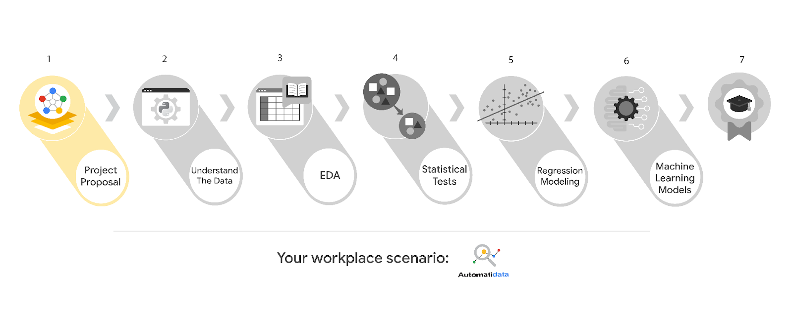

# Automatidata

# **Learn about the Course 1 Automatidata workplace scenario!**

The end-of-course project in Course 1 focuses on your ability to plan for data projects and create a project proposal. The end-of-course projects were designed with you in mind, offering an opportunity for you to practice and apply your data analytic skills. The materials provided here will guide you through discussions with co-workers, internal team members, and external stakeholders.

Learn more about the project, your role, and expectations in this reading.

## **Background on the Automatidata scenario**

Congrats on your new job as a data analyst at a data consulting firm called Automatidata. Automatidata works with its clients to transform their unused and stored data into useful solutions, such as performance dashboards, customer-facing tools, strategic business insights, and more. They specialize in identifying a client’s business needs and utilizing their data to meet those business needs.

Automatidata is consulting for the New York City Taxi and Limousine Commission (TLC). New York City TLC is an agency responsible for licensing and regulating New York City's taxi cabs and for-hire vehicles. The agency has partnered with Automatidata to develop a regression model that helps estimate taxi fares before the ride, based on data that TLC has gathered.

The TLC data comes from over 200,000 taxi and limousine licensees, making approximately one million combined trips per day.

***Note:*** This project's dataset was created for pedagogical purposes and may not be indicative of New York City taxi cab riders' behavior.

### **Project background**

Automatidata is in the earliest stages of the TLC project. The following tasks are needed before the team can begin the data analysis process:

* A project proposal identifying the following:
  * Organize project tasks into milestones
  * Classify tasks using the PACE workflow
  * Identify relevant stakeholders

### **Your assignment**

For your first assignment, Automatidata will need a project proposal that will create milestones for the tasks within the TLC project. Remember to take into account your audience, team, project goal, and PACE stages of each task in planning your project deliverable.

## **Team members at Automatidata and the New York City TLC**

### **Automatidata Team Members**

* Udo Bankole, Director of Data Analysis
* Deshawn Washington, Data Analysis Manager
* Luana Rodriquez, Senior Data Analyst
* Uli King, Senior Project Manager

Your teammates at Automatidata have technical experience with data analysis and data science. However, you should always be sure to keep summaries and messages to these team members concise and to the point.

### **New York City TLC Team Members**

* Juliana Soto, Finance and Administration Department Head
* Titus Nelson, Operations Manager

***Note:*** The story, all names, characters, and incidents portrayed in this project are fictitious. No identification with actual persons (living or deceased) is intended or should be inferred. The data shared in this project has been altered for pedagogical purposes.*

The TLC team members are program managers who oversee operations at the organization. Their roles are not highly technical, so be sure to adjust your language and explanation accordingly.

## **Meeting notes**

Now that you are working as Automatidata’s latest data analytics professional, you are given access to the company network and set up with a company email account (your first initial and last name, followed by @automatidata.org).

Opening your inbox, you notice an email from your supervisor, Deshawn.

**From:** Deshawn Washington

**Subject:** Review meeting notes

If you are able to read this, then your company accounts have been created! Now is the perfect time to get started. Last week, I attended an internal meeting with our leadership team about a new project we are about to begin. You’ll receive more information in the next few days, but I would like you to be aware of some needs that were identified by our leadership team. Here is an excerpt from the notes I took during the Automatidata leadership team meeting. I’ve organized the points by the person who made them.

Uli King  (Senior Project Manager)

* The data team will need a global-level project document to outline the goals and milestones.
* I am working closely with Titus Nelson over at the New York City Taxi and Limo Commission. He has requested some visuals to share with TLC’s executives.

Luana Rodriquez (Senior Data Analyst)

* The dataset from TLC has to be inspected before any analysis can begin.
* Our team needs to determine what information the TLC data provides through exploratory data analysis (EDA).
* Eventually, our team will need to test to find if the model is delivering consistent results.

Udo Bankole (Director of Data Analysis)

* Before we present any insights to TLC, we'll need to determine whether or not the model we produce meets the project requirements.
* Once we have a final model, I'll need to know the main talking points going into our presentation with TLC.

My thoughts and concerns…

* I think it's best to use Python for the TLC project. I'll have someone on my team set that up as soon as we have the plan in place.
* It will be important to establish the relationship between any variables within the TLC data. I'd suggest the data team consider A/B testing, since that will analyze the relationship between the two most useful variables and subsequently provide data-driven support for future business decisions.

Review the meeting notes above to become familiar with the project’s context. I’ll ask you to identify project tasks and come up with a structure to guide the data team through this project. After our discussion about your experience in the certificate program offered by Google, I know that your efficient communication style and problem-solving will enhance the abilities of the data team.

There will be more details sent to you very soon.

Welcome to the team,

Deshawn Washington

Data Analysis Manager

Automatidata

(P.S. There will be muffins in the break room every Tuesday morning. Be early…unless you like bran muffins. LOL)

## **Specific project deliverables**

With this end-of-course project, you will gain valuable practice and apply your new skills as you complete the following:

* Course 1 PACE Strategy Document to plan your project while considering your audience members, teammates, key milestones, and overall project goal.
* Create a project proposal for the data team.

## **Key takeaways**

The Google Advanced Data Analytics Certificate end-of-course project is designed for you to practice and apply course skills in a fictional workplace scenario. By completing each course’s end-of-course project, you will have work examples that will enhance your portfolio and showcase your skills for future employers.
