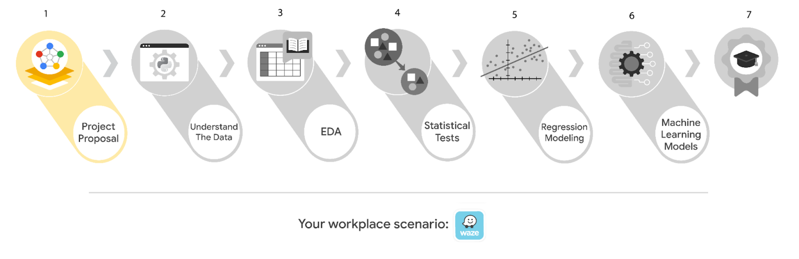

# Course 1 end-of-course portfolio project overview: Waze

# **Learn about the Course 1 Waze workplace scenario!**

The end-of-course project in Course 1 focuses on your ability to plan for data projects and create a project proposal. The end-of-course projects were designed with you in mind, offering an opportunity for you to practice and apply your data analytic skills. The materials provided here will guide you through discussions with co-workers, internal team members, and external stakeholders.

Learn more about the project, your role, and expectations in this reading.

## **Background on the Waze scenario**

Welcome to your new role at Waze! We’re thrilled to have you on the data team!

Waze’s free navigation app makes it easier for drivers around the world to get to where they want to go. Waze’s community of map editors, beta testers, translators, partners, and users helps make each drive better and safer. Waze partners with cities, transportation authorities, broadcasters, businesses, and first responders to help as many people as possible travel more efficiently and safely.

You’ll collaborate with your Waze teammates to analyze and interpret data, generate valuable insights, and help leadership make informed business decisions. Your team is about to start a new project to help prevent user churn on the Waze app. Churn quantifies the number of users who have uninstalled the Waze app or stopped using the app. This project focuses on monthly user churn. In your role, you will analyze user data and develop a machine learning model that predicts user churn.

This project is part of a larger effort at Waze to increase growth. Typically, high retention rates indicate satisfied users who repeatedly use the Waze app over time. Developing a churn prediction model will help prevent churn, improve user retention, and grow Waze’s business. An accurate model can also help identify specific factors that contribute to churn and answer questions such as:

* Who are the users most likely to churn?
* Why do users churn?
* When do users churn?

For example, if Waze can identify a segment of users who are at high risk of churning, Waze can proactively engage these users with special offers to try and retain them. Otherwise, Waze may simply lose these users without knowing why.

Your insights will help Waze leadership optimize the company’s retention strategy, enhance user experience, and make data-driven decisions about product development.

### **Project background**

Waze’s data team is in the earliest stages of the churn project. The following tasks are needed before the team can begin the data analysis process:

* A project proposal identifying the following:
  * Organize project tasks into milestones
  * Classify tasks using the PACE workflow
  * Identify relevant stakeholders

### **Your assignment**

For your first assignment, Waze is asking for a project proposal that will create milestones for the tasks within this project. Remember to take into account your audience, team, project goal, and PACE stages of each task in planning your project deliverable.

***Note:**** This project's dataset was created for pedagogical purposes and does not represent Waze’s actual data.*

## **Team members at Waze**

As a new data analyst, you’ll work closely with a talented team of experienced data professionals. You’ll also collaborate with Waze co-workers outside the data team as your project requires.

### **Data team roles**

* Harriet Hadzic - Director of Data Analysis
* May Santner - Data Analysis Manager
* Chidi Ga - Senior Data Analyst
* Sylvester Esperanza - Senior Project Manager

### **Other roles in the scenario**

* Emrick Larson - Finance and Administration Department Head
* Ursula Sayo - Operations Manager

***Note: ****The story, all names, characters, and incidents portrayed in this project are fictitious. No identification with actual persons (living or deceased) is intended or should be inferred. The data shared in this project has been altered for pedagogical purposes.*

The members of the data team have technical expertise in data analysis, and are familiar with  terms and concepts from statistics and machine learning. To communicate effectively with data team members, make sure your messages are clear, concise, and focused on key points.

Waze co-workers outside the data team may not have a background in data analysis, or be familiar with technical terms and concepts. When communicating with these co-workers, make sure to adjust your language to fit your audience, and clearly explain technical terms if necessary.

## **Meeting notes**

After onboarding, you are given access to the company network and set up with a company email account (your first initial and last name, followed by @Waze).

Opening your inbox, you notice an email from your supervisor, May Santner.

**From:** “May Santner,” May@waze.com

**Subject:** Your first task: Review meeting notes

If you are reading this message, then your company accounts have been created! Now is the perfect time to get started. Last week, I attended an internal meeting with our leadership team about a new project. You’ll receive more information in the next few days, but I’d like you to be aware of some key points made by leadership. Here is an excerpt from my meeting notes. I’ve organized the points by the person who made them.

**Sylvester Esperanza, Senior Project Manager**

* The data team will need a global-level project document to outline project goals and milestones.
* We will need to generate some visuals to share with the Waze executives.

**Chidi Ga, Senior Data Analyst**

* The dataset has to be inspected before any analysis can begin.
* The data team needs to learn more about the data through exploratory data analysis (EDA).
* Eventually, our team will need to test the model to find out if it's delivering consistent results.

**Harriet Hadzic, Director of Data Analysis**

* Before we share any insights, we'll need to determine whether or not our model meets the project requirements.
* Once we finalize the model, I'll need to know the main talking points for our presentation to the leadership team.

**My thoughts and concerns…**

* I think it's best to use Python for this project. I'll have someone on my team set that up as soon as we have the project proposal in place.
  * It will be important to establish the relationship between key variables in the dataset. I'd suggest the data team consider hypothesis testing.

Review the meeting notes and proposed tasks from each team member to become familiar with the project’s context. I’ll ask you to identify project tasks and come up with a structure to guide the data team through this project. After our discussion about your experience in the Google certificate program, I know that your efficient communication style and strong problem-solving skills will help the data team achieve its goals.

There will be more details sent to you soon.

Welcome to the team,

May Santner

Data Analysis Manager

Waze

(P.S. Don’t forget about our Data Superstars discussion group. Our next session is this Friday at 3pm. Each month, the team gets together to discuss the work of an innovative and inspiring historical figure. This month, it’s Ada Lovelace, often considered the world’s first computer programmer. This event is also a great opportunity to get to know your new teammates - and, if you want, try the outstanding coffee in the Waze cafe! Please join us!)

## **Specific project deliverables**

With this end-of-course project, you will gain valuable practice and apply your new skills as you complete the following deliverables:

* Course 1 PACE Strategy Document to plan your project while considering your audience members, teammates, key milestones, and overall project goal.
* Create a project proposal for the data team.

## **Key takeaways** 

The Google Advanced Data Analytics Certificate end-of-course project is designed for you to practice and apply course skills in a fictional workplace scenario. By completing each course’s end-of-course project, you will have work examples that will enhance your portfolio and showcase your skills for future employers.
