# Data discourse over the years

You will encounter the terms “data science” and “data analytics” throughout this program. Although these disciplines can be quite different in their scope, industry professionals often use them interchangeably. It’s important to examine the similarities and differences between data science and data analytics to better understand the data career field and where your skills fit. In this reading, you’ll learn more about data science, data analytics, and how the data profession has evolved over time.

## What is data science vs. data analytics

Data science is an entire field dedicated to making data more useful. A data scientist is a professional that uses raw data to develop new ways to model data and understand the unknown. Often, their job responsibilities incorporate various components of computer science, predictive analytics, statistics, and machine learning. The collections of information that data scientists work with can be quite large, requiring expertise to organize and navigate.

Data analytics is a subfield of the larger data science discipline. The aim of data analytics is to create methods to capture, process, and organize data to uncover actionable insights for current problems. Analysts focus on processing the information stored in existing datasets and establishing the best way to present this data. Data analysts rely on statistics and data modeling to solve problems and offer recommendations that can lead to immediate improvements.

The following table presents a side-by-side comparison:

| **Data science**                                                                              | **Data analytics**                                                                         |
| ----------------------------------------------------------------------------------------------- | -------------------------------------------------------------------------------------------- |
| * Produces broad insights that concentrate on which questions should be asked about data      | * Emphasizes discovering answers to questions being asked                                  |
| * Confronts what is unknown by using advanced techniques to make predictions about the future | * Determines actionable insights that can be applied immediately based on existing queries |
| * Seeks to answer questions like “What will happen?” and “How can we make X happen?”      | * Seeks to answer questions like “What happened?” and “Why did it happen?”             |

## The connections between data science and data analytics

Data science and data analytics share a fundamental goal: discover insights that can be used to lead an organization to improve and grow. They are closely connected with information gathered through interactions within the measurable world. As data projects become more complicated, organizations are discovering the advantages of assembling data teams, bringing data analysts and data scientists together. Within these highly-collaborative working environments, data scientists and data analysts work on common tasks using similar software packages, tools, and programming languages. Additionally, the responsibilities of data scientists and data analysts are impacted by a company’s resources, budgetary constraints, and other factors which vary depending on the organization and industry. The commonalities between data science and data analytics within the workplace explain why practitioners and industry professionals often use the two titles interchangeably. This has also extended to job postings.

## The data professional in the data career space

This program uses a few terms when addressing data science and data analytics professionals. The term **data professional** is used when referring to data scientists and analysts collectively. **Data analytics professional **is used to highlight positions where the majority of tasks focus on data analytical processes. The **data career space **functions as an inclusive term referencing the spectrum of jobs and careers in data science and related areas. The intention for these descriptors is to serve as inclusive labels—enabling the broadest possible grouping of data science and data analytics related jobs and titles.

Career opportunities for data professionals span a wide range of industries. Each with their individualized needs, demands, and responsibilities. It’s possible for two employees with the same job title at two different organizations to have different roles and tasks. To help clarify how careers across data science and data analytics are described in this program, the data career space is used to collectively refer to the variety of careers and job opportunities available to those with data science skills.

## The data career space over time

So far, you’ve been considering how data science and data analytics work together in the data career space. This field has also been evolving and changing over time as technology, data storage, data analysis, and communication has changed. Progress in the field means that data professionals need to learn to adapt and evolve to build and define careers within this space—and understanding how the data career space has evolved so far can help you do just that.

### 1965

*In 1965, the world’s population was 3.3 billion. The Mariner 4 spacecraft took the first close-up pictures of Mars. The first commercial communications satellite allowed nearly instantaneous contact between Europe and North America.*

| **Field**         | **Summary**                                                                                                                                                                                                                                                                                                                                                                                                                                         |
| ------------------- | ----------------------------------------------------------------------------------------------------------------------------------------------------------------------------------------------------------------------------------------------------------------------------------------------------------------------------------------------------------------------------------------------------------------------------------------------------- |
| **Technology**    | Computations were still done by hand; companies were just starting to  invest in new computing technologies to assist analysts. The first desktop programmable calculators replaced room-sized computers. Users could backup complex mathematical operations onto magnetic cards and print the results.                                                                                                                                             |
| **Data storage**  | Simple punch cards stored programming information. These cards would be loaded in a specific order to give commands. Businesses allocated physical space to store the thousands of data punch cards regular computer usage would generate. Larger organizations upgraded to magnetic tape reels that could hold the equivalent of 50,000 punch cards, or about 3 megabytes. But these reels still required a lot of storage space within an office. |
| **Data analysis** | As computer technology reduced in size and cost, more companies began to pivot away from doing computation work by hand.                                                                                                                                                                                                                                                                                                                            |
| **Communication** | Documentation and correspondence were transformed by the electric typewriter.Documents and messages were hand delivered within offices. New telephone systems allowed multiple incoming and outgoing lines, programmable buttons for saving phone numbers and intercom abilities for up to 30 extensions.                                                                                                                                           |

### 1985

*In 1985, the world’s population was 4.8 billion. The internet’s domain name system was created. A hole in the ozone layer over Antarctica was discovered. DNA is first used in a criminal case. *

| **Field**         | **Summary**                                                                                                                                                                                                                                                                           |
| ------------------- | --------------------------------------------------------------------------------------------------------------------------------------------------------------------------------------------------------------------------------------------------------------------------------------- |
| **Technology**    | Phone lines become the superhighways of communication. By the 1980s, the scanning fax machine became a necessity for businesses, allowing them to quickly send and receive documents. Desktops were now small enough for users to have a personal computer. Windows 1.0 was released. |
| **Data storage**  | The floppy disk format replaced data punch cards, allowing 360 kilobytes of data storage. The average internal hard drive capacity was 10 megabytes.                                                                                                                                  |
| **Data analysis** | Data organization was revolutionized with the development of electronic spreadsheets. These programs first emulated traditional financial ledgers.                                                                                                                                    |
| **Communication** | Internal electronic messages or email were being used by government agencies, universities, and defense/military industries to communicate.                                                                                                                                           |

### 2005

*In 2005, the world’s population was 6.5 billion. The first video was uploaded to YouTube. NASA’s Deep Impact space probe impacted a comet in motion.*

| **Field**         | **Summary**                                                                                                                                                                                                                                                                                                                                                        |
| ------------------- | -------------------------------------------------------------------------------------------------------------------------------------------------------------------------------------------------------------------------------------------------------------------------------------------------------------------------------------------------------------------- |
| **Technology**    | Dial-up connections are replaced with high-speed connectivity. Smart devices give an increasing number of people access to the internet, especially within urban areas. Businesses become aware of the usefulness of their collected user data.                                                                                                                    |
| **Data storage**  | Large-scale companies began digitizing and storing data within cloud services. Filing cabinets full of documentation were slowly being converted into data archives. Flash drives reached the market, offering a gigabyte of portable storage that could easily fit within a pocket.                                                                               |
| **Data analysis** | Companies employed data analysis and predictive modeling as primary business elements. Customer interaction yields datasets and data analysis opportunities, creating large repositories of unstructured data. Social media significantly elevated the need for tools, technologies, and analytics techniques to gather useful information from unstructured data. |
| **Communication** | Inter-department collaboration, worldwide email, and instant messaging became available on smart devices.                                                                                                                                                                                                                                                          |

### Today

*Today the world’s population is around 8 billion. The James Webb Space Telescope is expanding our knowledge of the universe’s earliest moments.*

| **Field**         | **Summary**                                                                                                                                                                                                                                                                                                                                                                                                                              |
| ------------------- | ------------------------------------------------------------------------------------------------------------------------------------------------------------------------------------------------------------------------------------------------------------------------------------------------------------------------------------------------------------------------------------------------------------------------------------------ |
| **Technology**    | Augmented and virtual reality offer interactive experiences, enriched by computer-generated information. The Internet of Things (IoT) connects a growing number of devices and systems. Edge computing is becoming a common practice; it is a way of distributing computational tasks over many nearby processors (i.e., computers) that is good for speed and resiliency and does not depend on a single source of computational power. |
| **Data storage**  | Quantum computing, a type of computing that employs the collective properties of quantum mechanics, is being developed to increase processing and storage and solve problems that are too complex for classical computers. International efforts will continue to build quantum computing systems with the necessary cooling systems, user interfaces, networks, and storage capabilities.                                               |
| **Data analysis** | Artificial intelligence is helping to speed up the rate of innovation by augmenting human capabilities. This technology resides at the intersection between social and technological issues. Technological advances continue to be inspired by biological and psychological knowledge about how humans process and learn information.                                                                                                    |
| **Communication** | Virtual meetings and online messaging have become commonplace. Task management software is helping organizations facilitate the completion of projects, allowing workers across the globe to work asynchronously.                                                                                                                                                                                                                        |

## Key takeaways

Data science and data analytics are distinct but connected fields that have developed over time in the evolving data career space. Organizations often use these terms interchangeably when hiring, so being able to recognize the similarities and differences between the two professions will help you identify opportunities that are aligned with your particular skill set. That’s why, throughout this course, you will learn more about the data career space as a whole and how data analytics professionals work within that space.

# Profiles of data professionals

You have been learning about data professionals and how valuable their work is to the companies that employ them. You also learned about technical and strategic roles for data analytics professionals. Data analysts in technical roles transform raw data into something useful for decision-making. Strategic data analytics professionals focus on maximizing information to guide the businesses they are working for. In this reading, you will learn more about the data professional career space, and see examples of some general categories of data professional roles.

The classifications of data professional roles presented here are a very general introduction to the careers available within the data career space. When you begin to look for a job, you may encounter entry-level, mid and senior positions within each of these general categories.

## Data scientist and data analyst

Data scientist and data analyst are roles that work directly with data. These professionals gather, clean, analyze, and share insights from data with stakeholders. An increasing number of industries turn to data analysis to create insights that inform various tasks like guide decision-making, identify user preferences, or determine how to use resources more effectively. With more industries looking for data professionals, there is a great chance that you will find one that matches your interests.

### **Key attributes**

* **What they do: **Uncover trends, patterns, and insights from data
* **How they do it: **Employ advanced modeling and statistical analytics techniques
* Entry-level data scientist or analyst positions may not require considerable data analysis experience and be less restrictive about requiring those hired to hold a traditional degree.

### **Sample job titles**

* Data scientist
* Marketing analyst
* Data analyst
* AI analyst
* Business analyst

## Data management and infrastructure

Data professionals that work in data management and infrastructural roles are primarily responsible for the systems that distribute data and maintain its integrity. They work alongside data analytics professionals and help support their work. Their main responsibility is to ensure the functionality of data systems and the compliance with local, state, and federal regulations involving data security and ethics.

### **Key attributes**

* **What they do: **Manage data sources and the overall data infrastructure
* **How they do it: **Work with the tools and databases used to manage data within a business

### **Sample job titles**

* Data engineer
* Technology engineer
* Data manager
* Data steward
* IT architect

## Business intelligence

Data analytics and business intelligence share a lot of commonalities. Both fields have professionals that use data to create insights that inform decision-making. A major difference is that business intelligence is more focused on creating processes and information channels that transform relevant data. Business intelligence professionals create tables, reports, and dashboards that empower stakeholders, giving them access to the data they need to inform the entire decision-making process on a continual basis. These roles often serve as a complement to core data analytics/data science professionals.

### **Key attributes**

* **What they do: **Perform predictive analysis that enables organizations to determine likely future trends
* **How they do it: **Create tables, reports and dashboards that empower their organization

### **Sample job titles**

* BI architect
* BI analyst
* BI solution developer
* BI software engineer
* Data viz & BI analyst

# Additional roles for data professionals

## Product development teams

The professionals in these roles manage a portfolio of customer and stakeholder analytic projects and initiatives. They often manage the analytical strategy for the organization. In these roles, experience is most likely required, and responsibilities are larger and more global.

### **Key attributes**

* **What they do: **Manage analytical strategy within a project team
* **How they do it: **They are less hands-on with data analysis, serving as the person a data scientist or analysts would report to

### **Sample job titles**

* Product manager
* Product developer
* Product lead
* Digital product manager
* Customer product manager

## C-suite

This classification of roles covers high-ranking executives within an organization. The ‘C’ in c-suite stands for chief. In general, there's a trend for the c-suite to build data-driven decision making into their processes. Individuals filling these roles within organizational leadership teams are expected to be familiar with data and analytics.

### **Key attributes**

* **What they do:** Responsible for data and data professionals across an entire organization
* **How they do it:** They are decision makers found at the top end of a company’s hierarchy

### **Examples of job titles**

* Chief marketing officer
* Chief data officer
* Chief analytics officer
* Chief information officer
* Chief data scientist

## Key takeaways

There are a wide variety of roles and responsibilities in the data professional career space. Later, you will learn how these roles work together and collaborate with groups of professionals with diverse expertise on data analysis projects. Having a general understanding of the roles and responsibilities of data professionals can help inform your job search. This information can serve as a reference that can help you understand the needs and expectations of companies as you navigate through job postings. Take inventory of any transferable skills you may already possess from educational or professional experience.

# Where data makes a difference for the future

As you have been learning, the data analytics field is dynamic, spanning a variety of industries. For you and other data professionals searching for new job prospects, there are great opportunities across a spectrum of career fields. As you start to think about your own future role in data analytics, it can help to investigate how data is being used within different industries. In this reading, you’ll consider some examples of industries and how data analytics helps guide them. You’ll also consider the future of data analytics and how the field is still evolving!

There are so many different industries taking advantage of data analytics in so many different ways. Here is just a sample of some of these industries and how they use data:

| **Industry**                                  | **Overview**                                                                                                                                                              | **How data is used**                                                                                                                                                                                                                                                                                                                                             |
| ----------------------------------------------- | --------------------------------------------------------------------------------------------------------------------------------------------------------------------------- | ------------------------------------------------------------------------------------------------------------------------------------------------------------------------------------------------------------------------------------------------------------------------------------------------------------------------------------------------------------------ |
| App-driven business (sharing economy service) | Facilitates users acquiring, providing, or sharing access to goods and services, often through online or app-based communities                                            | * Maintaining functioning mobile applications* Delivering customized content based on user history including discounts* Using machine learning models to send notifications at key times or even locations                                                                                                                                                       |
| Automotive                                    | Includes industries associated with the production, wholesaling, retailing, and maintenance of motor vehicles                                                             | * Gaining greater control over their supply chains* Improving production line performance, and designing new and more efficient vehicles* Enhancing vehicle safety and new features                                                                                                                                                                              |
| Cybersecurity                                 | Protects networks, devices, and data from unauthorized access or criminal use and the practice of maintaining confidentiality, integrity, and availability of information | * Locating weak points within networks and systems using predictive analytics* Defending against security attacks* Detecting data breaches through logic, models, and data tools* Improving the ability to identify attacks and respond to them with Artificial Intelligence (AI)                                                                                |
| Digital marketing                             | Assists in advertising and promotional efforts of companies using the internet and online technologies                                                                    | * Translating customer interaction into actionable business data* Predicting user behaviors to personalize content and offers* Identifying patterns and trends that guide innovations* Determining the return on investment (ROI) of marketing efforts                                                                                                           |
| Energy                                        | Includes companies that explore, produce, refine, market, store, and transport both renewable and non-renewable energy resources                                          | * Analyzing real-time data from power systems and monitoring devices* Optimizing technologies, monitoring power grids, and predicting failures* Preventing accidents and malfunctions                                                                                                                                                                            |
| Gaming                                        | Hosts an estimated 2.7 billion gamers worldwide, facilitating the interaction of players across the globe                                                                 | * Designing world-building and character creation systems* Monitoring character engagement and how the environment reacts to player input* Optimizing game-play by identifying potential new features or upgrades* Regulating in-game purchases and fraud detection systems* Personalizing marketing campaigns                                                   |
| Streaming media and entertainment             | Provides access to live and recorded content on-demand, delivered via the internet to computers, smart devices, and mobile devices                                        | * Analyzing and monitoring user interactions to better understand customer sentiment* Matching users with advertisers with real-time analytics* Guiding future content decisions* Personalizing marketing campaigns                                                                                                                                              |
| Telecommunications                            | Primarily involves operating and providing access to facilities for the transmission of voice, data, text, sound, and video                                               | * Assisting the deployment, optimization, and predictive maintenance of telecommunications networks* Optimizing pricing models* Targeting advertisement and incentive campaigns, as well as detecting fraudulent activity* Analyzing customer data to customize subscriber plans                                                                                 |
| Travel and tourism                            | Encompasses a variety of services from transportation, accommodations, attractions, booking, and much more                                                                | * Marketing to individuals based on their previous travel or searched destinations* Directing machine learning systems that can adjust a traveler’s itinerary based on set factors including weather and availability* Generating recommendations based on personal preferences and location-based discounts* Managing reservations and processing transactions |

## Data trends for the future

As you can already tell, data analytics is an emerging field with a wide range of exciting opportunities. And, even more exciting is the fact that big data is getting bigger. The need for people to understand, prioritize, manage, and analyze that information is not slowing down in any industry. Businesses will continue to rely on data-driven decision-making, fueled by both simple trend analyses and more complex techniques like predictive modeling and forecasting.

Additionally, more companies are storing all of their raw data within large repositories accessible across the organization. As companies become more reliant on insights generated by this data, there will be many opportunities for data analytics professionals to use their skills and knowledge to organize that information and make it useful.

## Innovative technologies

Innovations in accessing this data are leading to new approaches in making data interconnected—meaning that there are still new and evolving ways businesses in different industries are going to use data in the future. Technology is also ever-changing and adapting to these new needs. Because of this, there will always be exciting new tools and data solutions to explore.

Artificial intelligence will continue to have a large impact on business, helping to streamline many areas. For example, an increase in sales is understood to be a direct result of forecasting product demand. Artificial intelligence helps companies ensure warehouse supply, keep items in stock, reduce delivery time, and boost operational efficiency through automating processes.

Additionally, artificial intelligence will combine with machine learning, business intelligence, and automation to deliver more personalized services to customers.

Offering additional services will push forward innovation, bringing computer applications and the sources of stored data closer together physically. This concept is referred to as **edge computing**. By closing the gap between data and computation, speed improves. This results in greater support of real-time analytics and the automation necessary to support the increasing number of devices that are becoming linked through the [internet of things](https://en.wikipedia.org/wiki/Internet_of_things).

An increasing number of data analytics tasks will be automated by creating, managing, and analyzing data in edge environments. Artificial intelligence and machine learning systems are only as equitable and inclusive as the people who create and train these systems. You will learn more about how you, as a data analytics professional, will need to take steps to ensure equity in the future.

## Key takeaways

As you progress through your career as a data analytics professional, you will need to stay up-to-date with the latest trends and technologies used across different industries. The one certainty about the future of data analytics is that an increasing amount of data will continue to be generated and that new systems and innovations will continue to be developed, allowing data professionals an opportunity to learn, grow, and develop new skills.

# Ideal qualities for data analytics professionals

You have been learning about skills that can help you enter and excel in the data career space. In this program, you will be building technical abilities, which are necessary before pursuing opportunities in data analytics. Job postings will include a list of the required technical skills prominently displayed. Quite often, organizations will also make note of additional skills and traits that go beyond working with data on a computer. In this reading, you will explore examples of additional skills and traits that employers are seeking when searching for data analytics professionals.

As you begin to search for job opportunities, many employers seek additional skills that are not exclusive to digital fields. In the sections below, you will learn more about these traits through excerpts found within data analytics job postings.

## Being coachable

Coachable individuals are capable of receiving feedback and using that information to make improvements. At the center of being coachable is a positive attitude, and the ability to self-reflect and take steps to grow. People who are coachable usually have a growth mindset, which is a belief that hard work and determination can make them better. As a result, they view feedback from colleagues and supervisors as an opportunity to improve their skill set.

## A passion for data analysis

Employers often seek candidates whose commitment to data analysis extends beyond their professional duties. Volunteering your data skills to help a nonprofit organization is just one example, but it’s not the only way to show your commitment to data analytics. Data analysis is applicable outside of the workplace, but is often not obvious. Community projects, helping a local school organize data, and developing your own side project are a few examples of how you might demonstrate your passion for data analysis outside of the workplace.

Another way to explore your passion for data analysis is to connect with other passionate data analysts and take on data challenges. A great website for exploring data analytics is [Kaggle.com](https://www.kaggle.com/), which hosts an active online community for data scientists and machine learning enthusiasts. Users can collaborate with other users, publish datasets, use GPU-integrated notebooks, and compete with other data scientists to solve data science challenges. Participating in activities hosted by an online data science community like Kaggle can add fuel to your passion for data analysis and provide artifacts for your portfolio.

Employers are seeking passionate candidates. Job postings that identify candidates that have a passion for data analysis often include language like:

* Seeking a passionate data scientist.
* We seek a candidate with deep curiosity directed toward diverse research interests.
* Driven. The prospect of focusing on corporate environmental impact as a data domain excites you, and you are personally motivated.

**Pro tip**: Include in your portfolio your passion for data analysis. Provide examples of passion projects, volunteer work, or analysis outside of employment to relay your commitment to data analysis. If you are conducting data analysis in your free time, it says a lot about your passion.

## Lifelong learning

Earlier, you read about some generational shifts in data workspaces. You may recall that these shifts have included technological advances in computer interfaces, data storage, and the role of data analysis in organizations.  In fact, the one consistent element through all of these eras was change. As you progress in your career, you will continue to learn new techniques, tools, and ways of interacting with other professionals. As you have learned, staying up to date with the latest technologies and techniques is essential for data professionals. Here are samples from actual job posting:

* Candidates must balance their hands-on work with a desire to keep up with trends.
* Seeking candidates with the aptitude and enthusiasm to develop new skills and areas of expertise.
* Wanting those with a drive to learn and master new technologies and techniques.

**Pro tip**: Stay current by reading data-related blogs and attending workshops. Visit business networking websites to connect and learn from subject matter experts.

## Strong interpersonal skills

You may recall that data professionals and business intelligence professionals interact closely; together, they influence an organization's decision-making. Throughout a project, a data analyst will interact with many stakeholders, from different areas of an organization. Often, these interactions will extend to include clients, users, or representatives from other companies. Additionally, data professionals will work closely with a variety of other professionals as a member of a cross-functional team. Examples from job postings include interpersonal skill requirements for candidates and will include these types of statements:

* We seek employees that can build relationships internally to transfer knowledge, consult with fellow data scientists and analysts to guide analysis, and deliver larger projects.
* Wanting to hire those with the ability to negotiate complex and/or sensitive issues; and maintain good working relations.
* Our data professionals value building strong relationships with colleagues and partners.

**Pro tip**: Include interpersonal skills on your list of qualifications on your resume. Revisit the material within this program (including the material on communication you will be introduced to later in this course). Find opportunities to add examples of teamwork, empathy, leadership, mediating, and active listening.

## Communication

Professionals working in data, business, and technology are expected to be fluent communicators. The effectiveness of your work will weigh heavily on your ability to inspire people through the results of your analysis. Job postings can contain requirements like the following:

* Candidates must have excellent communication skills and a friendly, approachable personality.
* You’re a compelling storyteller who can communicate in succinct and inspiring ways to audiences with varied data science experience to influence real world product or feature decisions.
* A storyteller. You know that no data speaks for itself and take pride in the visualizations and narrative that you construct to communicate your careful analysis.

**Pro tip:** Be sure that all correspondences you exchange are professional and free of grammatical and spelling errors. Include any examples of written communication in your portfolio–these may include but are not limited to reflection pieces, executive summaries, or  project proposals. Don’t forget to include writing examples or online blog entries that describe how you have communicated in past situations.

## Problem solver

The ability to resolve problems is an important part of being a data analytics professional, whether it's dealing with incomplete data, resolving issues within an analysis, or finding the best way to communicate your results to your audience. It is important that you also quantify the results of problems that you have solved. Organizations who seek data professionals have included problem-solving in their job descriptions, such as:

* Seeking data professionals who have the capability and the strong desire to solve problems from concept development, customer engagement, and technology transition.
* Candidates must be persistent and have excellent analytical and problem-solving skills.
* A big thinker. You start with "why" when approaching a new problem, and are always wanting to generalize, synthesize, and summarize.

**Pro tip**: Adjust your past working responsibilities into tasks that you were able to achieve. This can be accomplished by stressing the end results of your actions. Detail how your action or task had a direct impact on the organization. If there is a measured or empirical amount of change associated with your actions, be sure to include that. Example: Analyzed data from over 3,000 users to optimize systems, which led to a 32% increase in customer satisfaction.

## Key takeaways

Employers in a variety of industries are eager to hire data professionals who possess more than just technical expertise. You can highlight your non-technical abilities for potential employers in several ways. Discover ways to successfully and effectively communicate your passions. By demonstrating a commitment to professional growth and sharing examples of your ability to solve problems, you can set yourself apart from other candidates.

# Volunteer data skills to make a positive impact

So far, you have been learning how data analytics professionals are making an impact in a variety of industries. You’ve also learned about nonprofit organizations, and how their efforts are making a difference for so many in need. By volunteering their expertise and time, data analytics professionals contribute to many projects that help nonprofits benefit communities all around the world. In this reading, you will learn more about how you can contribute to global efforts, including  your local community as a data professional.

## Nonprofits

People hoping to further a social cause, or provide a benefit to the public, often create nonprofit groups. The main mission of a nonprofit group is to fill a need or gap that the private sector is not addressing adequately. There are rewarding and inspiring opportunities for data professionals in the nonprofit sector. At the global level, groups like [Children International](https://www.children.org/), [Doctors Without Borders](https://www.doctorswithoutborders.org/), and [Care International](https://www.care-international.org/) lead humanitarian efforts across the globe. In addition to these large-scale efforts, there are many nonprofit organizations whose efforts are regionally specific, like [Christopher’s Promise](http://www.christopherspromise.org/) based in the Columbus, Ohio area.

You can apply your data skills to help nonprofit groups become more effective, allowing them to anticipate and respond to their greatest areas of need.

You may already be aware of nonprofits that fit within your areas of interest or operate in your community. One way that these organizations compensate for their lack of resources is by finding volunteers. Often, regional or local organizations lack the resources to offer full time employment for marketing professionals or data analysts. As a data analytics professional there are many ways that you can make a valuable contribution to nonprofit organizations. In the event that you do not have a specific nonprofit organization in mind, you can research through [Charity Navigator](https://www.charitynavigator.org/), the largest and most trusted online nonprofit evaluation and rating tool in the world. Here you will find ratings on nearly 200,000 nonprofits.

## An example of a community-based nonprofit organization

[Christopher’s Promise](http://www.christopherspromise.org/home.html), a grass-roots nonprofit based in Columbus, Ohio, is a representative example of the types of community-based nonprofits that are making an impact all over the world. This organization was inspired by the efforts to create a bicycle for a fifteen-year old who faced the challenges of Neurofibromatosis, Cerebral Palsy, and Optic Glioma. Since 2011, this nonprofit has facilitated the design and construction of adaptive bicycles for hundreds of children, thanks to outstanding support from the local communities in the central Ohio area.

Christopher’s Promise (2022) mission statement is  “To allow all kids, despite physical limitations, the ability to experience the same hallmark childhood memories as their peers. Helping kids, be kids.”

## Volunteering data skills to nonprofits

As a data analytics professional, your skills can make a great impact on charity and nonprofit organizations within your own community or for a community whose needs resonate with you. Many nonprofits are highly dependent on volunteers for their activities due to limited resources. This situation is especially challenging for community-based initiatives that often lack the funding to hire data analytics professionals. Therefore, offering to volunteer with a local nonprofit is an excellent way to gain experience and support a cause.

### How can data analytics professionals help nonprofits?

Data analytics professionals can help nonprofit organizations in a variety of ways. Below are a few examples.

#### Fundraising

Using data analytics, you can predict with high accuracy which prospects are most likely to donate. In order to maximize return on marketing and outreach expenses, nonprofit organizations can use data analysis to prioritize outreach and reduce overall marketing expenditures.

#### Marketing

There is valuable information in a nonprofit’s data that can benefit marketing efforts. Data analysis can help determine a nonprofit’s target audience and gather insights such as donation methods, contribution history, and other demographics. As a result, the nonprofit can help guide communication with potential donors and determine the effectiveness of campaigns.

#### Monitoring activities

Data analysis can help nonprofits monitor resources, expenses, and daily operational needs. A nonprofit will often need assistance in keeping track of donated materials. For example, a database of donations to a food bank could help the organization determine specific food items being collected and inventory the expiration dates of food items for shelving, cycling, and distribution. Using a system of real-time inventory in conjunction with predictive data analytics could anticipate shortages and identify those donors who have helped provide these items in the past.

Data analytics has a lot to offer a nonprofit organization. Gaining deeper insight into the organization’s efforts can help them to operate in a more effective and efficient way. Analyzing data can improve various nonprofit functions, such as allocation of resources, recruiting and retaining supporters, fundraising, and conducting research. Data analysis also can help reveal patterns and power dynamics that can be used to inform decision-making. In addition to identifying individuals and communities in need of assistance, predictive modeling can also be used to identify potential recipients of a nonprofit's services.

## More opportunities to volunteer

There are organizations who are helping to pair data professionals with projects that are making a difference all around the world.

DataKind is a global nonprofit that harnesses the power of data science and artificial intelligence (“AI”) in the service of humanity. Using data analysis, this organization guides restorative efforts in underserved communities. DataKind brings together volunteer experts from academia and industry to design innovative solutions to tough social challenges. They help social organizations apply their data to predictive analytics, machine learning algorithms, and AI in a way that both increases impact and is sensitive to ethical considerations. Visit the [DataKind website](https://www.datakind.org/join-us/volunteer/) to find out more about their mission and how to become a volunteer.

Another option for putting your data skills to good use are hackathons. A hackathon is an event where programmers and other data professionals come together and collaborate on a particular project. The goal is to create a solution to an existing problem.

There are many hackathon events scheduled across the world each year. These events can take place at a specific location or remotely across the globe. Hackathon events are commonly built around a central theme or question, such as tracking industrial emissions, promoting healthy food options, or how we can improve mental health for cancer patients. If you are interested in finding listings of current hackathons around the world, visit [Devpost.com](https://devpost.com/).

## Key takeaways

Donating your time to a nonprofit is a great way to gain experience, and it can be mutually beneficial for you and the nonprofit. The nonprofit benefits from your data analysis expertise, and you get valuable experience working with data that can be added to your professional portfolio.

Working with a nonprofit organization or participating in a hackathon event introduces you to different types of projects, enhances interpersonal and communications skills, and adds to your professional list of contacts. No matter what your level of data analytics experience, working with nonprofits and hackathons can be a rewarding side project, or even a philanthropic career option.

## Resources for more information

* [Charity Navigator](https://www.charitynavigator.org/) is the world's largest and most trusted nonprofit evaluator.
* [DataKind](https://www.datakind.org/) helps social organizations identify their data and artificial intelligence opportunities, recruits and manages volunteers, and then sees the solutions are used.
* [Devpost](https://devpost.com/) is a place to build products, practice skills, learn technologies, sign up for competitions, and grow your network.
* [IRS.gov tax exempt organizations listing](https://www.irs.gov/charities-non-profits/search-for-tax-exempt-organizations) is a website to find charitable organizations throughout the United States.
* [Statistics without borders](https://www.statisticswithoutborders.org/) contributes to the common good by providing free statistical, data science, and analytical services.

# Critical data security and privacy principles

You have learned how data analytics can be used for good causes, like assisting nonprofit organizations. Also, you learned that data professionals need to protect privacy within data and remain aware of other considerations, like data bias and making assumptions about data.

As a data analytics professional, you have a responsibility to handle data ethically. Data ethics refers to well-founded standards of right and wrong that dictate how data is collected, shared, and used. Throughout your career you will work with a lot of data. This sometimes includes PII, or **personally identifiable information,** which can be used by itself or with other data to track down a person's identity. One element of treating data ethically is ensuring that the privacy and security of that data is maintained throughout its lifetime. In this reading, you will learn more about the importance of data privacy and some strategies for protecting the privacy of data subjects.

## Privacy matters

Data privacy means preserving a data subject’s information and activity any time a data transaction occurs. This is also called information privacy or data protection. Data privacy is concerned with the access, use, and collection of personal data. For the people whose data is being collected, this means they have the right to:

* Protection from unauthorized access to their private data
* Freedom from inappropriate use of their data
* The right to inspect, update, or correct their data
* Ability to give consent to data collection
* Legal right to access the data

In order to maintain these rights, businesses and organizations have to put privacy measures in place to protect individuals’ data. This is also a matter of trust. The public’s ability to trust companies with personal data is important. It’s what makes people want to use a company’s product, share their information, and more.

## Protecting privacy with data anonymization

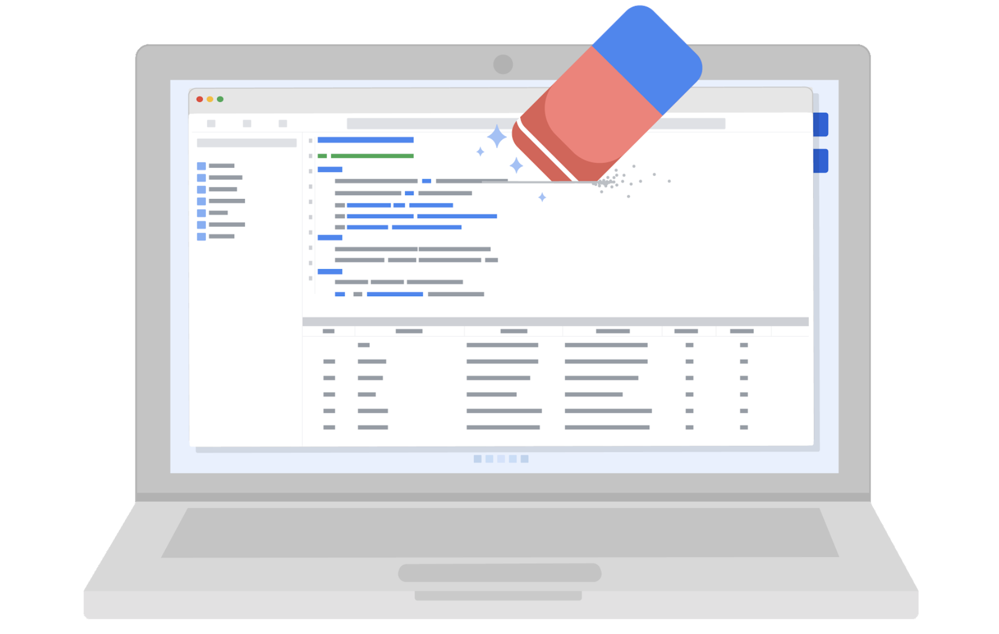

Organizations use a lot of different measures to protect the privacy of their data subjects, like incorporating access permissions to ensure that only the people who are supposed to access that information can do so. Another key strategy to maintaining privacy is data anonymization.

**Data anonymization** is the process of protecting people's private or sensitive data by eliminating PII. Typically, data anonymization involves blanking, hashing, or masking personal information, often by using fixed-length codes to represent data columns, or hiding data with altered values.

Data professionals can take additional measures to protect users and their data. **Data aggregation**, for example, is the process of collecting and combining details from a significant number of users in terms of totals or summary. Aggregating data ensures that information contained within datasets is shown in groups; when coupled with other anonymization techniques, data professionals can ensure compliance with data privacy and anonymization standards.

Data anonymization is used in just about every industry. As a data analytics professional, you probably won’t personally be performing anonymization, but it’s useful to understand what kinds of data are often anonymized before you start working with it. This data might include:

* Telephone numbers
* Names
* License plates and license numbers
* Social security numbers
* IP addresses
* Medical records
* Email addresses
* Photographs
* Account numbers

Imagine a world where we all had access to each other’s addresses, account numbers, and other identifiable information. That would invade a lot of people’s privacy and make the world less safe. Data anonymization is one of the ways we can help keep data private and secure!

## Key takeaways

For any professional working with data about actual people, it’s important to consider the safety and privacy of those individuals. That’s why understanding the importance of data privacy and how data that contains PII can be made secure for analysis is so important. We have a responsibility to protect people’s data and the personal information that data might contain.

If you’re interested in learning more about data privacy and ethics, you can check out [the Google Data Analytics Certificate program’s section on bias, credibility, privacy, ethics, and access](https://www.coursera.org/learn/data-preparation/home/week/2).

# The practices and principles of good data stewardship

As you have been learning, all data professionals are responsible for ensuring the quality, integrity, accessibility, and security of data. Data stewardship is the practice of ensuring that data is accessible, usable, and safe. Making data stewardship a normal part of your work habits will benefit everyone who relies on your analysis, both inside and outside of your organization. In this reading, you will learn more about data stewardship and receive some best practices that can assist in guiding your career in data analytics.

## Respect privacy

Earlier in this course, you learned about Information that permits the identity of an individual to be inferred by either direct or indirect means. This kind of information is commonly referred to as personally identifiable information or PII. When users share personal information, they are putting a high level of trust into an organization. It is the responsibility of all who have access within the organization to help protect the privacy of their users. As a data analytics professional, it is important to be thoughtful about any personal data and exhibit great care to protect it. In different parts of the world, laws are in place to guide best practices for data privacy. Laws provide a foundation for best practices as you grow in knowledge and experience on how to support and sustain privacy. One of your responsibilities as a data professional will be to stay up to date with any change in data laws and regulations that govern data. Depending on your organization’s location or industry considerations, there may be additional regulations and policies in place. Here are a couple of regional examples:

* General Data Protection Regulation or [GDPR](https://gdpr.eu/) (European Union law):
  * The GDPR is described on their website as the toughest privacy and security law in the world. It imposes obligations onto organizations anywhere, so long as they target or collect data related to people in the European Union.
* Lei Geral de Proteção de Dados Pessoais or [LGPD](https://www.gov.br/cidadania/pt-br/acesso-a-informacao/lgpd) (Brazil’s general law for the protection of personal data):
  * The LGPD is a data protection law that governs how companies collect, use, disclose, and process personal data belonging to people in Brazil. LGPD applies to companies that process data about individuals in Brazil.
* The California Consumers Privacy Act or [CCPA](https://oag.ca.gov/privacy/ccpa) (Privacy rights for California consumers):
  * The CCPA gives consumers more control over the personal information that businesses collect about them. These regulations provide guidance on how to implement the law.
  * Additionally, states like Virginia, Colorado, New York, Utah, and Connecticut have enacted similar legislation to protect consumer privacy in their states.

## Be cautious of unintentional harm

Data analytics is expanding its influence across an increasing range of industries. Companies are using the results of data analysis to make informed decisions. Many of these decisions have the potential to impact people across a broad range of social and economic factors. It is good practice to continually strive to produce information that is accurate, while respecting cultural and social norms.

Due to the global marketplace, decisions play out differently in different cultures. Taking these issues and considerations into account is very important for the executive team of an organization. Also, companies are known to take a position on particular politicized social and cultural issues, and these can be reflected in their policies. As a data analytics professional, you must be cognizant of your company’s policies. When presented with challenges, it is best to seek guidance from leadership within your organization on how to navigate.

## Avoid creating or reinforcing bias

You have learned about bias within data and how it can have an impact on your analysis. Identifying bias is not always simple. A good practice when working with data is to keep in mind that data gathering is a task managed by humans–and that process is informed by people from different backgrounds, experiences, beliefs, and worldviews. These and other types of biases can affect the data and the results, which in turn can have an impact on business decisions. You will learn more about bias within data as you progress through the program.

## Consider inclusivity

Often in your role as a data analytics professional, you will have access to data collected in a variety of ways. You will need to consider whether the methods of data collection have excluded information from particular populations. Inclusionary approaches can expand how any organization collects and analyzes data. Building diverse research teams, communicating clearly with user communities, and engaging in careful and critical analysis that considers equity and inclusion benefits all stakeholders.

## Uphold high standards of scientific excellence

The processes and technology that you will interact with as a data analytics professional are deeply rooted in the scientific method. As you continue in your data professional journey, embrace inquiry, intellectual discussion, and collaboration. Invite feedback and assess feedback. Remember, artificial intelligence still depends heavily on the instructions provided by data professionals. The more time and consideration that goes into the process of data analytics, the better the results.

Different industries have different standards. In your role as a data analytical professional, you will need to be aware of the standards for the industries you are working in. Each industry will have its own standards based on industry conventions.

Conventions that work well in the transportation industry may not necessarily be as high of a priority for the healthcare industry. For example, in transportation, data is collected to create predictive analytics models to analyze the best route based on traffic patterns. In the healthcare industry, data is analyzed in medical imaging, predicting genetic factors, and speeding up the development of treatments.

## Data stewardship and ethics conversations

As you progress through your career as a data analytics professional, you will need to consider issues of ethical concern. For example, you may encounter situations where you address questions of bias or need to protect user data and personally identifiable information (PII). When these types of questions arise, many seek guidance and support from online communities of data professionals who have dealt with similar issues. The following graphics present scenarios involving these kinds of issues. You can also find text alternative versions of these conversations in the 

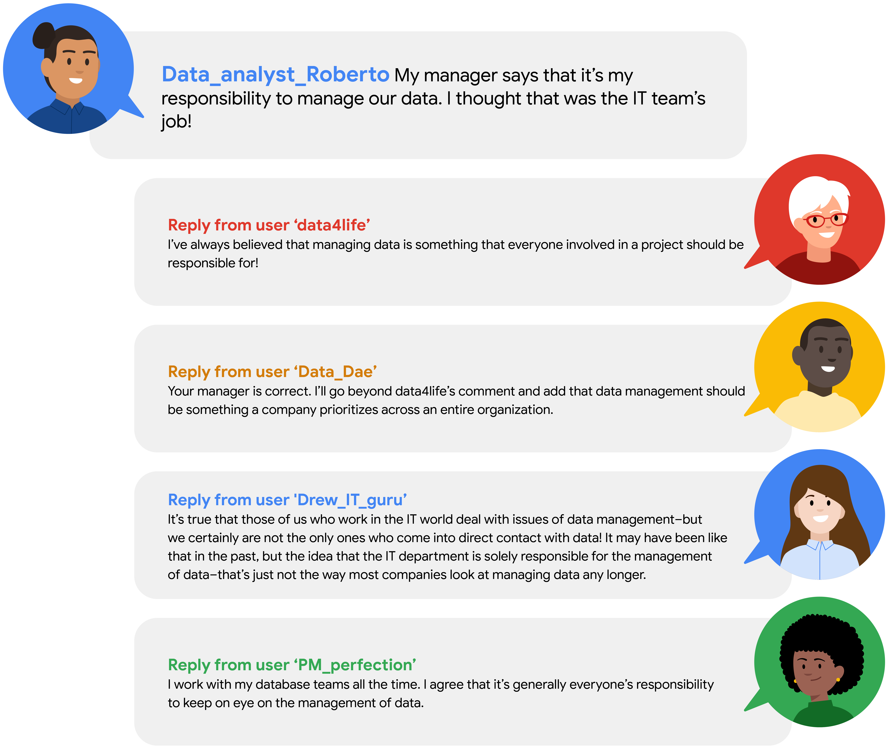

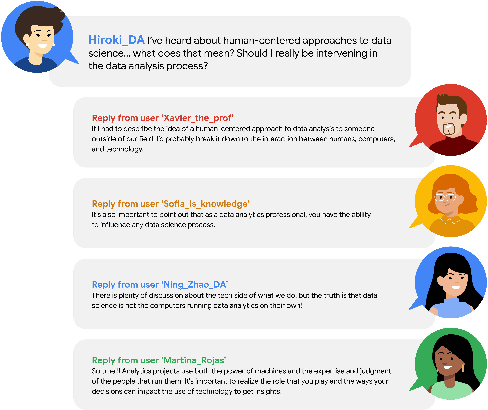

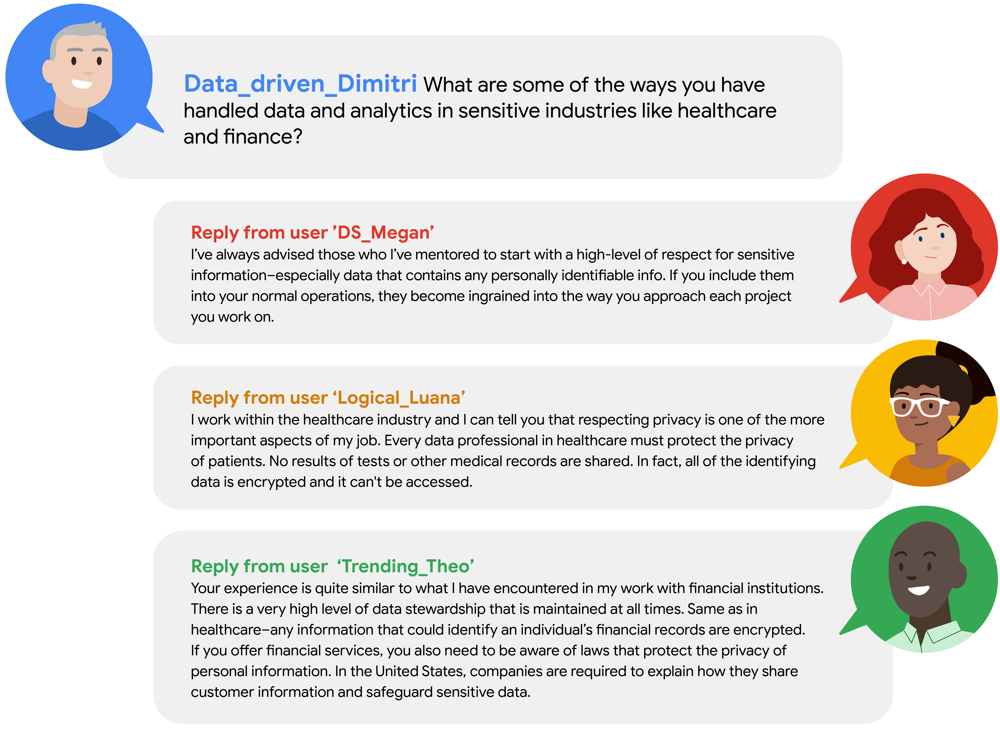

## Key takeaways

Data stewardship is the responsibility of every data professional. This responsibility goes beyond interactions with the data. By conducting your work in ways that are socially beneficial and inclusive, you will increase your ability to identify human bias. Guide your efforts through scientific and ethical principles and stay aware of possible bias throughout the data analysis process.

# Build the perfect data team

You have been learning about the role of data analytics professionals within organizations and the work they perform. You’ve also examined some general classifications for data professional roles.  Additionally, you explored what a typical data analytics profession might experience during the initial days in a new position. Large organizations often have more data needs, requiring the creation of teams to take on projects. In this reading, you will learn more about how organizations build data analytics teams and look at some best practices when constructing them.

## **Designing data analytics teams**

The idea of companies creating teams of data professionals developed over time and largely out of necessity. Originally, the responsibilities of data collection, management, and analysis fell onto the CIO (chief information officer) of the company. CIOs in the past would typically hand the responsibilities over to the IT (Informational technology) team.

Gradually, organizations began separating data functions as the wealth of information stored grew. Additionally, new technologies emerged and data-related tasks became more specialized.

### Data professional profiles within large organizations

Earlier in this course, you were introduced to some data professional profiles.

* Data Scientist
* Data Analyst
* Data Engineer
* Analytic Team Manager
* Business Intelligence Engineer

These profiles are very generalized categories that can help you focus your eventual job search. In reality, many employers are looking for more than data professionals. They are looking for project stakeholders, dependable team members, and great co-workers.

### Building the team

The data needs of larger companies requires the creation of a team of skilled professionals. The members of these teams each have a specialized area of expertise. Some will come from business backgrounds, some with project or staff management experience, while others will have more technical skills. While there is no checklist available for companies to follow when putting together their team of data professionals, the needs of their organization can help guide them.

Creating a team of data analytics professionals is very similar to how sports franchises put together championship-level rosters. Coaches and general managers are always looking to upgrade and enhance the capabilities of their teams. While having a superstar athlete can help deliver a consistent performance at a certain position, their abrupt departure can compromise the team’s overall performance. A better approach is to develop a well-balanced and collaborative team.

Employers want to hire someone who has more than data analytic skills. They are selecting the best fit for their organization. Candidates who bring additional experience and skills beyond data analytics are most often seen as most favorable. Strong interpersonal and communication skills, experience working in business, or within a team dynamic can enhance data analytics. There is a very good chance that you already possess some of these skills.

## Five principles for data team building

After you join a data team, there are still challenges to building a data-driven organization. Below you will find five principles that can guide any organization to becoming more effective when facing the challenges of data analysis, regardless of the structure of your data teams within the company.

### 1. Adaptability

Data platforms, networks and storage options need to allow flexibility. Each data professional will have their preferences as to the tools and their approaches to analysis. Remote and on-site employees need to have access and the ability to work with all data and use the tools of communication they feel are the most productive.

Organizations need to facilitate a data platform that allows open access to resources for all users. Instead of specifying specific software solutions, organizations can expand their pool of candidates by allowing individuals to integrate the tools and applications they are most comfortable and experienced with. Flexibility invites a wide range of experience and enhances data teams, adding experience and additional perspectives.

Just as organizations need to be adaptable, those seeking opportunities in data fields should be committed to learning new skills and technologies. Data workplaces are undergoing constant change, as you learned earlier. As a data analytics professional, you will continue to learn and grow as newer technologies or regulations emerge.  Accept the challenge presented by new circumstances and let yourself feel energized when presented with opportunities for professional growth.

**Pro tip: **Keep your desire for learning. Expand your knowledge through online data science communities and educational opportunities.

### 2. Activation

Access to data analysis results require someone with the background and experience of a data analyst. Even small-scale data operations require skills that go beyond the scope of other professionals within an organization.

To become more data literate, organizations should cultivate new habits and integrate them into their daily work routines. Dashboards and other accessible interfaces can help promote the use of data analysis, enabling wider usage of data analysis, promoting communication and fostering cross-departmental collaboration.

Vital to the success of an organization's efforts to transform its internal habits and culture are the interpersonal skills of its employees. When a company is seeking to expand data literacy, its data professionals play an important role. There will be opportunities to help promote understanding among peers and colleagues. The time spent answering questions and promoting understanding will help others appreciate you and your contributions to the organization.

**Pro tip:** Maintain positive professional relationships through effective communication. Your ability to share insights is just as important to an organization as your analyzing skills.

### 3. Standardization

An organization needs to set criteria for the standardization of data practices and procedures. Standardization helps to promote best practices, and communication and transferability of information between teams. When users can share optimized code and other assets it saves development time and streamlines projects. An organization that builds a culture of collaboration embeds best practices into work behaviors.

Identifying candidates with capabilities beyond data analysis is essential to developing and standardizing best practices. To develop best practices, organizations need employees that contribute innovative solutions to problems.

**Pro tip:** Become a problem solver. Obstacles within a project can turn into opportunities for innovation, which can transform an organization.

### 4. Accountability

Data analysis is a complex and dynamic process that requires a high level of accountability. To promote responsibility, organizations need a ‘paper trail’ that allows examination of their entire process.

Accountability adds transparency, explainability, and security to data teams and projects. It also helps to eliminate layers within an organization, while aligning business goals and customer values. Transparency in workflow allows organizations to answer specific questions about the data analysis process. Data analytics professionals can use project metadata to examine and communicate specific elements within their prediction models, giving data teams the collaborative ability to make adjustments with more precision.

One way to promote accountability is to extend your ability to communicate throughout your workflow. Within data analytical projects, the transfer of ideas extends beyond individual correspondence. It also includes information in project notes, records kept within projects, and proper tagging within metadata. Individual processes and ideas are the incubators of standards of practice and communicating these ideas effectively can improve an organization’s accountability.

**Pro tip: **Data analytics professionals are more than repositories of information. It benefits everyone involved in a project if you are able to communicate your knowledge and observations. Identify what would be most valuable to others and provide the information.

### 5. Business impact

Often, the inability to estimate the impact on the business can block data analysis projects. Organizations are not considering all available data analytical solutions during the planning stage.

Organizations should look at approaching data projects with the widest field of view in the planning stage. This requires a thoughtful approach including considerations beyond data analysis.  For example, the difficulty of integration, commitment of resources, and changes to the project timeline. Businesses need to consider more data solutions options and identify which benefit the project the most.

Broadening the scope of an organization takes time and consistency of results. To achieve this, a data team must become a trusted resource for insight and a positive influence on an organization's decision-making process. An effective communication strategy, strong interpersonal skills, and a track record of problem-solving will earn the trust of the organization.

**Pro tip: **Focus on communicating clearly with stakeholders. Maintain a commitment to consistency between what you have promised and what you will deliver.

## Key takeaways

Organizations carefully consider the individuals they bring into their organization and seek candidates that embody qualities that go beyond data skills. Additionally, companies can influence their adaptability by hiring data professionals that embody the spirit of lifelong learning, effective communication, interpersonal skills, and the ability to solve problems.

# Current and future tools

One of the greatest skills a data professional can have is learning how to apply their knowledge of one tool to another tool. Throughout your career, you might discover that different organizations you work for use different tools—and in the field of data science, new and emerging technologies mean that exciting new tools are being developed all the time. This means there will always be opportunities to expand your data science toolkit! In this reading, you will learn more about tools today, including some of the tools you’re going to learn about in this program. You will also explore some of the exciting ways tools are evolving and what that might mean for your toolkit in the future. Finally, you will explore a demonstration that illustrates how you’ll be using some of these tools in the very near future.

## Tools today

In this certificate program, you will have the opportunity to learn about many common tools data professionals use every day: spreadsheets, databases, query languages, data visualization, programming languages, and dashboards. Understanding the current tool landscape—and how it’s changing—will help you continue to grow your data science skills throughout your career. And understanding how the skills you learn for one tool can be applied to another means that you can adapt and add more tools to your toolkit!

| **Tool**              | **Definition**                                                                 | **Examples**                                                         | **Transferable skills**                                                                                                  |
| ----------------------- | -------------------------------------------------------------------------------- | ---------------------------------------------------------------------- | -------------------------------------------------------------------------------------------------------------------------- |
| Spreadsheets          | A digital worksheet where data can be manipulated and used for calculations    | * Google Sheets* Microsoft Excel                                     | * Data entry* Mathematical calculations* Manage datasets* Task automation* Data manipulation* Data analysis              |
| Databases             | A collection of data stored in a computer system                               | * Google Cloud* CloudSQL* Oracle* Microsoft SQL Server               | * Database design* Data storage management* Data integrity                                                               |
| Programming languages | A system of words and symbols used to write instructions that computers follow | * SQL* R* Python* Java* C++                                          | * Communicate with computer systems* Write and input commands* Manage datasets* Data manipulation* Data analysis         |
| Data visualization    | The graphical representation of data                                           | * Tableau* Matplotlib* Seaborn* Google Charts* InfoGram* ChartBlocks | * Communicate data insights* Design compelling visuals* Identify key metrics                                             |
| Dashboards            | A tool that monitors live, incoming data                                       | * Tableau* LookerStudio* Microsoft PowerBI                           | * Communicate data insights* Monitor real-time data* Develop data visualizations* Design filters and custom calculations |

Already, there are so many tools to choose from as a data professional. This certificate program will focus primarily on Python and data visualizations. As you progress in your career, you might find yourself learning new tools, and using your existing skills in new ways. Being able to recognize where tool skills overlap will help you continuously grow your data toolkit now and in the future.

## You in the near future

So far in this reading, you have been considering how the skills you’re going to learn in this certificate program will help you use even more tools in the future. As you prepare for your learning journey, you can also think about how you’ll be able to apply these skills soon—not just in the distant future.

This certificate program focuses on some of the most commonly used tools for data analytics and machine learning with Python. More specifically, you will use:

* NumPy and pandas for data processing and manipulation
* matplotlib.pyplot, seaborn, and Tableau for visualizations
* statsmodels for statistical tests and regression modeling
* scikit-learn for building machine learning models

Next, consider the following overview of some of the tools you’ll use to complete tasks in this certificate program.

You’ll use pandas to view and manipulate tabular data with Python. In the following example, a comma-separated value (.csv) file is read into a pandas dataframe, of which the first five rows are displayed. A dataframe is basically a table used to organize data. This data is from the [UC Irvine Machine Learning Repository](http://archive.ics.uci.edu/dataset/560/seoul+bike+sharing+demand). It contains the count of public bicycles rented per hour in the Seoul Bike Sharing System, with corresponding weather data and holiday information.

You’ll use NumPy and pandas to perform calculations and get statistics for your data.

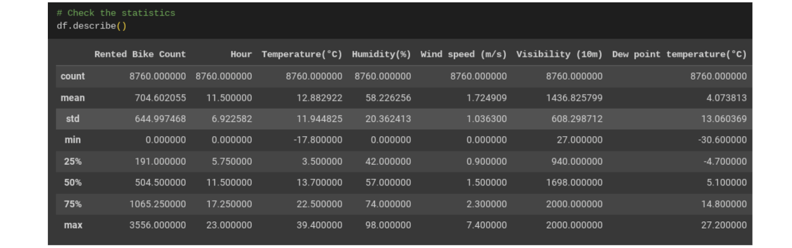

You’ll use Tableau, matplotlib.pyplot, and seaborn to create data visualizations.

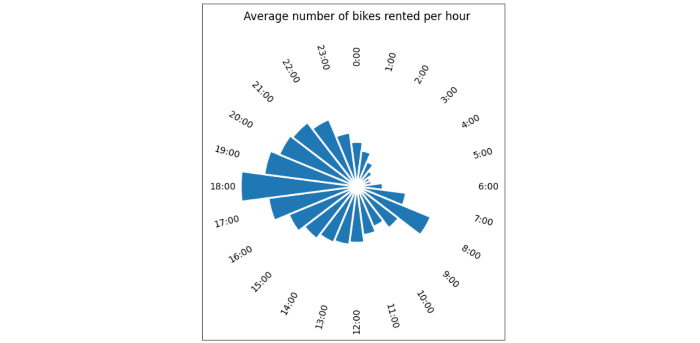

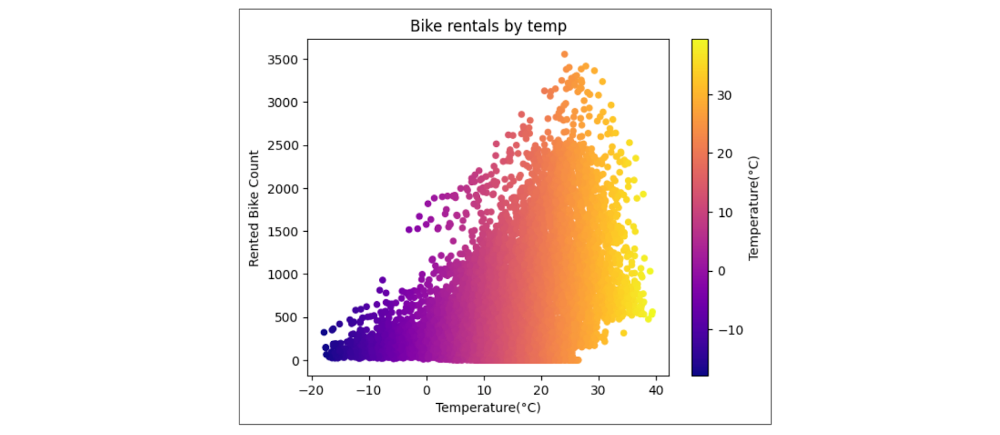

You’ll use statsmodels to practice statistical analysis and linear regression.

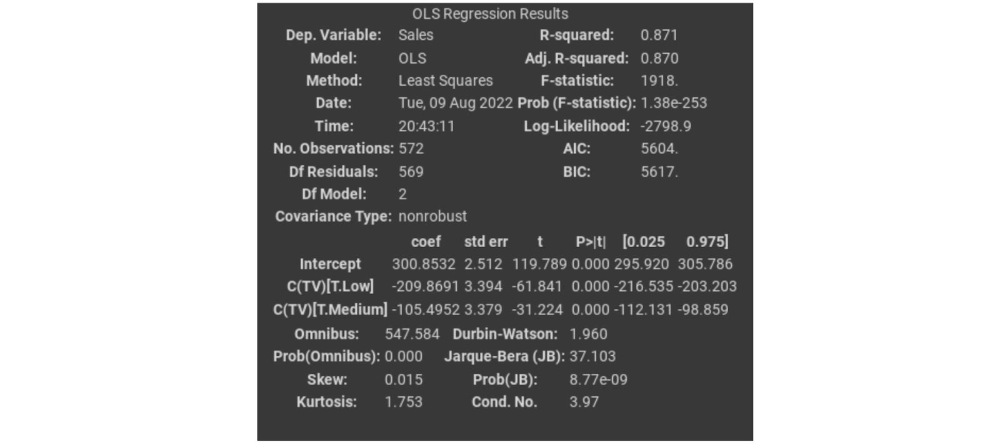

And you’ll use scikit-learn to build and analyze machine learning models:

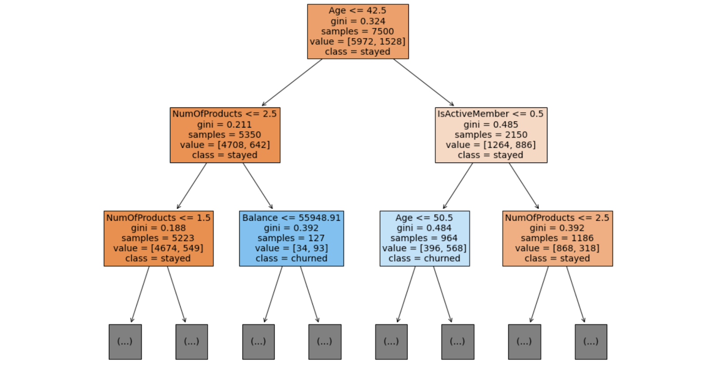

This is just a small sample of the full range of topics you’ll learn about in this certificate. As you gain proficiency with these tools, you’ll be equipped to take on nearly any data task.

## Tools tomorrow and beyond

The world of data science is always growing and evolving—tools you might not have even known about a few years ago can quickly become necessary for professionals working in the field. As you consider the skills you are developing now, it can be useful to consider all the ways you might also use them in the future.

### Artificial intelligence

Artificial intelligence, or AI, refers to computer systems that are able to perform tasks that normally require human intelligence. One of the great benefits of using AI for data science is that it can help provide real-time insights to stakeholders. For example, a business with an e-commerce website might use AI to monitor and deliver insights about how customers use their website in real-time, allowing the team to make quick improvements.

In today's dynamic workplace where leveraging the latest technology is key for productivity and efficiency, having an understanding of AI will boost your career as a data professional. While building a career in this industry, you can start enhancing your AI skills by exploring available AI tools that can assist with your role. One tool that's currently used is Tableau AI. Tableau AI aims to simplify the process of data analysis. This tool has the potential to help data professionals prepare data, reduce repetitive tasks, and suggest appropriate visualizations.

### Machine learning

Machine learning is the use and development of algorithms and statistical models to teach computer systems to analyze and discover patterns in data. Data analysts can train algorithms to analyze large amounts of data that would otherwise take a long time to process. For example, a financial analyst might use machine learning to find patterns in the data that help identify fraud.

One of the most exciting developments in these future technologies is the way they can be used together to automate tasks and provide insights faster than ever.

## Key takeaways

As a data professional, you will continue learning new skills and applying your current skills in new ways throughout your career. Recognizing how skills can be transferable allows you to adapt to different organizations’ needs and evolving technologies. And as you progress through this, you add tools to your data science toolbox that will help you now and in the future!

# How data professionals use AI

Earlier, you briefly considered the role of artificial intelligence in data science. You may recall that **artificial intelligence (AI) **refers to the development of computer systems able to perform tasks that normally require human intelligence. For example, practical applications of AI include voice assistants, autonomous vehicles, automated recommendation systems, and more.

In this reading, you will learn more about the uses of AI for data work, and how AI can help data professionals better understand their data and make more informed decisions. You’ll also learn about the limitations of AI, and the differences between AI and human data professionals.

## The uses of AI for data work

Data professionals can use AI to improve their data analysis, perform essential tasks, and streamline their workflow. For example, data professionals can use AI to:

* Create predictive models to help accurately forecast future events or outcomes.
* Automate time-consuming tasks such as data cleaning, coding, and report writing.
* Analyze extremely large datasets.
* Improve the quality of data by identifying and correcting errors.
* Generate insights from data that would not be obvious to humans.
* Provide guidance on tasks such as choosing the right algorithms and interpreting results.
* Facilitate* *collaboration among team members.

Data professionals can leverage AI to enhance the quality and efficiency of their data projects, generate valuable insights, and help stakeholders make better business decisions.

### **Conversational AI tools: Gemini and ChatGPT**

Many data professionals now use conversational AI tools to help them analyze their data and boost their productivity. Two of the most frequently used tools are Gemini and ChatGPT.  Gemini was created by Google AI. ChatGPT, also known as Chat Generative Pre-trained Transformer, was developed by OpenAI.

Gemini and ChatGPT are both** large language models (LLMs) **that are trained on massive datasets of text and code. An LLM** **is a type of AI algorithm that uses deep learning techniques to identify patterns in text and map how different words and phrases relate to each other. This allows LLMs to predict what word should come next. LLMs can generate human-like text in response to a wide range of prompts and questions.

**Note**: This is a general introduction to LLMs. A detailed discussion of the development and computational logic of LLMs is beyond the scope of this course.

Tools like Gemini and ChatGPT can help data professionals in a variety of ways. A data professional might ask Gemini or ChatGPT to:

* Clean a dataset by removing missing values, outliers, and duplicate data.
* Create interactive data visualizations such as dashboards and heatmaps.
* Recommend a specific algorithm for a particular task based on the data professional's input.
* Create a shared document to facilitate a brainstorming session among a team of data professionals.

**Note**: This is a brief list of possible prompts. In another activity, you’ll get a chance to further explore Gemini and discover its capabilities.

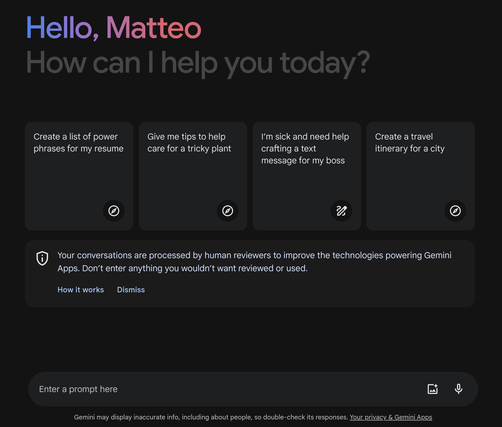

# How data professionals use AI

Earlier, you briefly considered the role of artificial intelligence in data science. You may recall that **artificial intelligence (AI) **refers to the development of computer systems able to perform tasks that normally require human intelligence. For example, practical applications of AI include voice assistants, autonomous vehicles, automated recommendation systems, and more.

In this reading, you will learn more about the uses of AI for data work, and how AI can help data professionals better understand their data and make more informed decisions. You’ll also learn about the limitations of AI, and the differences between AI and human data professionals.

## The uses of AI for data work

Data professionals can use AI to improve their data analysis, perform essential tasks, and streamline their workflow. For example, data professionals can use AI to:

* Create predictive models to help accurately forecast future events or outcomes.
* Automate time-consuming tasks such as data cleaning, coding, and report writing.
* Analyze extremely large datasets.
* Improve the quality of data by identifying and correcting errors.
* Generate insights from data that would not be obvious to humans.
* Provide guidance on tasks such as choosing the right algorithms and interpreting results.
* Facilitate* *collaboration among team members.

Data professionals can leverage AI to enhance the quality and efficiency of their data projects, generate valuable insights, and help stakeholders make better business decisions.

### **Conversational AI tools: Gemini and ChatGPT**

Many data professionals now use conversational AI tools to help them analyze their data and boost their productivity. Two of the most frequently used tools are Gemini and ChatGPT.  Gemini was created by Google AI. ChatGPT, also known as Chat Generative Pre-trained Transformer, was developed by OpenAI.

Gemini and ChatGPT are both** large language models (LLMs) **that are trained on massive datasets of text and code. An LLM** **is a type of AI algorithm that uses deep learning techniques to identify patterns in text and map how different words and phrases relate to each other. This allows LLMs to predict what word should come next. LLMs can generate human-like text in response to a wide range of prompts and questions.

**Note**: This is a general introduction to LLMs. A detailed discussion of the development and computational logic of LLMs is beyond the scope of this course.

Tools like Gemini and ChatGPT can help data professionals in a variety of ways. A data professional might ask Gemini or ChatGPT to:

* Clean a dataset by removing missing values, outliers, and duplicate data.
* Create interactive data visualizations such as dashboards and heatmaps.
* Recommend a specific algorithm for a particular task based on the data professional's input.
* Create a shared document to facilitate a brainstorming session among a team of data professionals.

**Note**: This is a brief list of possible prompts. In another activity, you’ll get a chance to further explore Gemini and discover its capabilities.

## Use cases for AI

Data professionals across industries use AI to help analyze data and generate insights for stakeholders. Here are some examples of how data professionals use AI in specific sectors:

### Finance

* Analyze financial transactions to help prevent fraud and protect customers' money.
* Analyze large datasets of financial data to help identify potential risks and make more informed decisions about investments.
* Analyze historical market data and current market conditions to help generate sound investment recommendations.

### Retail

* Recommend products to customers based on their past purchase history and browsing behavior.
* Track customers' interactions with the retail website to help personalize the shopping experience.
* Analyze sales data and forecast future demand to help optimize the amount of product inventory and reduce costs.

### Manufacturing

* Automate tasks such as welding, painting, and assembly to help improve efficiency.
* Analyze data from sensors and cameras to help identify defects in products before they are shipped to customers.
* Analyze data from production lines to help identify ways to produce more products at a lower cost.

## AI and human data professionals

Data professionals use AI as a tool to help them understand data, make better decisions, and improve efficiency. Like all tools, AI has limitations. Human data professionals possess skills, abilities, and qualities that AI currently lacks. For example:

* *Intuition*. AI models are trained on data, and they can only make decisions based on the patterns they observe in the data. Humans can use their intuition and personal experience to make decisions that are not explicitly programmed into the AI model. For this reason, it’s important to always verify a model’s output before relying on it.
* *Deal with ambiguity.* AI models are good at solving problems that are well-defined and have clear parameters. However, humans can identify and understand complex problems that are not well-defined and have ambiguous parameters by considering key details offered in the context of the project.
* *Interpersonal communication*. AI models can generate reports and presentations, but they cannot communicate with stakeholders in the nuanced way that humans can. Humans can explain the results of their analysis to fit the needs of specific stakeholders, and use their emotional intelligence to address concerns.
* *Creativity*. AI models are good at following instructions, but they are not imaginative like humans. Humans can be creative in their approach to data analysis, and imagine new and innovative solutions to complex problems.
* *Critical thinking*. Humans can think critically about their data and identify potential biases and ethical issues. AI models are usually trained on real-world data that contains biases and are therefore likely to reflect those biases in model outputs.
* *Leadership*. Humans can be leaders, and they can motivate and inspire others. AI may have difficulty understanding the nuances of human emotion, motivation, and communication. This limits AI’s ability to effectively run an organization.
* *Factuality. *Generative AI models are trained to output text based on patterns in language. Sometimes the model output may be very well-composed and as a result, seem reliable, but may not be factual. As noted above, it’s important to always verify model output.

In the future, product and research teams may develop updates for AI that enlarge its current capabilities. However, human data professionals will continue to play an important role in data science by using their intuition, imagination, and unique experience to solve complex problems.

## Key takeaways

Data professionals can use AI to help automate tasks, make predictions, generate insights, and communicate findings. They can leverage AI to be more productive in their work and more impactful in their organizations. Overall, AI is a powerful tool for data professionals but it is not without limitations. For this reason, human oversight and intervention is critical when working with AI and related tools

## Use cases for AI

Data professionals across industries use AI to help analyze data and generate insights for stakeholders. Here are some examples of how data professionals use AI in specific sectors:

### Finance

* Analyze financial transactions to help prevent fraud and protect customers' money.
* Analyze large datasets of financial data to help identify potential risks and make more informed decisions about investments.
* Analyze historical market data and current market conditions to help generate sound investment recommendations.

### Retail

* Recommend products to customers based on their past purchase history and browsing behavior.
* Track customers' interactions with the retail website to help personalize the shopping experience.
* Analyze sales data and forecast future demand to help optimize the amount of product inventory and reduce costs.

### Manufacturing

* Automate tasks such as welding, painting, and assembly to help improve efficiency.
* Analyze data from sensors and cameras to help identify defects in products before they are shipped to customers.
* Analyze data from production lines to help identify ways to produce more products at a lower cost.

## AI and human data professionals

Data professionals use AI as a tool to help them understand data, make better decisions, and improve efficiency. Like all tools, AI has limitations. Human data professionals possess skills, abilities, and qualities that AI currently lacks. For example:

* *Intuition*. AI models are trained on data, and they can only make decisions based on the patterns they observe in the data. Humans can use their intuition and personal experience to make decisions that are not explicitly programmed into the AI model. For this reason, it’s important to always verify a model’s output before relying on it.
* *Deal with ambiguity.* AI models are good at solving problems that are well-defined and have clear parameters. However, humans can identify and understand complex problems that are not well-defined and have ambiguous parameters by considering key details offered in the context of the project.
* *Interpersonal communication*. AI models can generate reports and presentations, but they cannot communicate with stakeholders in the nuanced way that humans can. Humans can explain the results of their analysis to fit the needs of specific stakeholders, and use their emotional intelligence to address concerns.
* *Creativity*. AI models are good at following instructions, but they are not imaginative like humans. Humans can be creative in their approach to data analysis, and imagine new and innovative solutions to complex problems.
* *Critical thinking*. Humans can think critically about their data and identify potential biases and ethical issues. AI models are usually trained on real-world data that contains biases and are therefore likely to reflect those biases in model outputs.
* *Leadership*. Humans can be leaders, and they can motivate and inspire others. AI may have difficulty understanding the nuances of human emotion, motivation, and communication. This limits AI’s ability to effectively run an organization.
* *Factuality. *Generative AI models are trained to output text based on patterns in language. Sometimes the model output may be very well-composed and as a result, seem reliable, but may not be factual. As noted above, it’s important to always verify model output.

In the future, product and research teams may develop updates for AI that enlarge its current capabilities. However, human data professionals will continue to play an important role in data science by using their intuition, imagination, and unique experience to solve complex problems.

## Key takeaways

Data professionals can use AI to help automate tasks, make predictions, generate insights, and communicate findings. They can leverage AI to be more productive in their work and more impactful in their organizations. Overall, AI is a powerful tool for data professionals but it is not without limitations. For this reason, human oversight and intervention is critical when working with AI and related tools.

# The places you’ll go…

By now you’re familiar with many of the tools data professionals use to overcome different challenges in their work. However, as important as these technical skills are for your professional development, creating engaging presentations of your work is just as important. As you complete this certificate program, you’ll create a portfolio of projects that you can showcase to employers, other learners, or to broader audiences. In this reading you’ll find examples of the many ways other data professionals in the field have shared their work, so that you can learn what such presentations entail, get a sense of what appeals to you, and perhaps even inspire you in your own journey.

## **Tableau dashboards**

Bill Yost is a data analyst. One way he leverages his data professional skills is by building interactive data visualization dashboards on Tableau. His [project on office supply store analytics](https://public.tableau.com/app/profile/bill.yost/viz/SuperstoreELVTR/SuperstoreDashboard) is a great example of the dynamic capabilities Tableau offers data professionals.

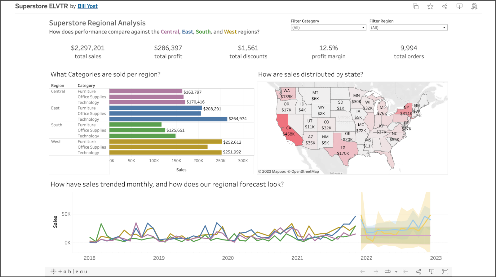

His  dashboard incorporates several different types of interactive graphs, including a bar chart, a line chart, and a map. You’ll learn how to create these in this certificate program.

Tableau also allows you to create a profile to showcase your work. You can also follow other users and add projects that interest you to a list of favorites.

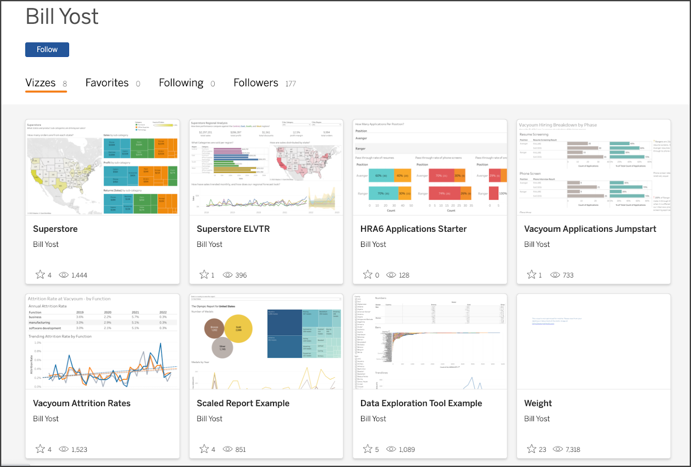

Tableau is a great platform if you want to feature polished visualizations and demonstrate your ability to communicate results in an engaging and elegant way.

## **Notebooks on Kaggle**

If you prefer to compose a more technical exposition of your work, Kaggle is a great place to do it. For example, consider [Jesse Mostipak’s profile](https://www.kaggle.com/jessemostipak). Jesse is a data professional who uses Kaggle to contribute coding exemplars and datasets, participate in modeling competitions, and converse with others in the data community.

The following is an example of a notebook she submitted as a tutorial on using XGBoost in tidymodels, which is a collection of R packages for modeling and machine learning. You’ll learn how to use XGBoost with Python later in this certificate program.

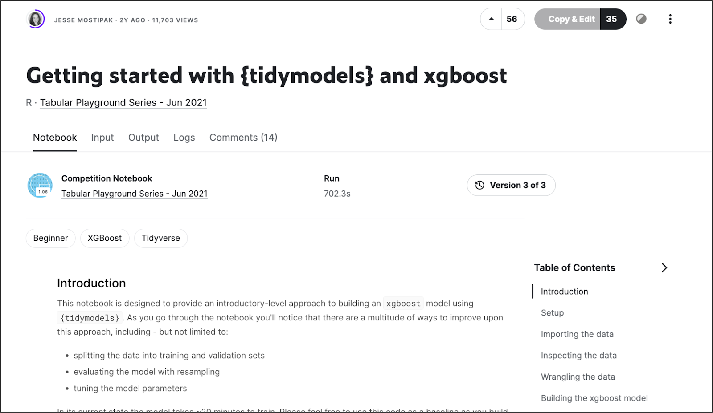

In addition to supporting your public presence as a data practitioner, publishing your work this way is a great opportunity to generate discussion of different approaches and methodologies with peers in the data community and to learn new skills.

## **GitHub repositories**

Another way to feature your work is by using GitHub. GitHub is probably best known for being a version control system used by coders and developers worldwide to keep track of projects involving large codebases with many simultaneous contributors. GitHub also offers tools to create and customize user profiles and project repositories. Take [Ravin Kumar’s GitHub page](https://github.com/canyon289) for example.

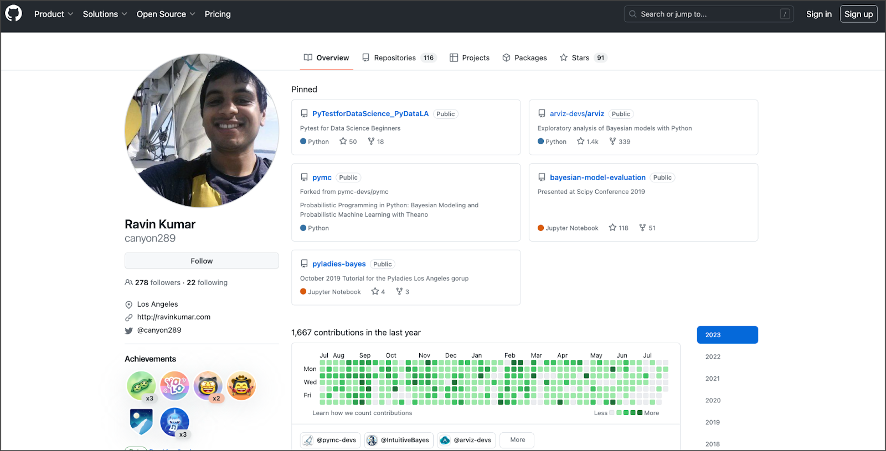

Some advantages of GitHub include the ability to structure your projects into repositories, which are like folders that are accessible to other people via Git. Repositories can include Jupyter notebooks, computer programs, images and figures, and markdown exposition. You’ll work extensively with Jupyter notebooks and markdown text throughout this certificate program. GitHub also lets you watch, star, and follow users or individual projects. The platform is particularly useful for sharing code directly with other people and even working collaboratively with them on projects.

## **Blogs on Medium**

Jupyter notebooks and coding exhibitions aren’t the only means by which you can demonstrate expertise. Blog posts are another great way to propel your professional development. One of the advantages of blogs is that they showcase a wide range of highly sought-after skills beyond just technical proficiency. For example, not only will a well-written blog post convey your understanding of data concepts, tools, and techniques, but it will also emphasize your critical thinking, communication, and writing skills. These types of skills are what distinguish the best data professionals in the field.

Medium is a great platform to post data science-related blogs. You can also submit to publishers of curated data science content, such as Towards Data Science, Analytics Vidhya, and KDNuggets. As an example, consider the following [article written by Cassie Kozykov](https://towardsdatascience.com/how-to-work-with-someone-elses-data-f33485d79ed4) (the instructor of this course) that was published on Towards Data Science.

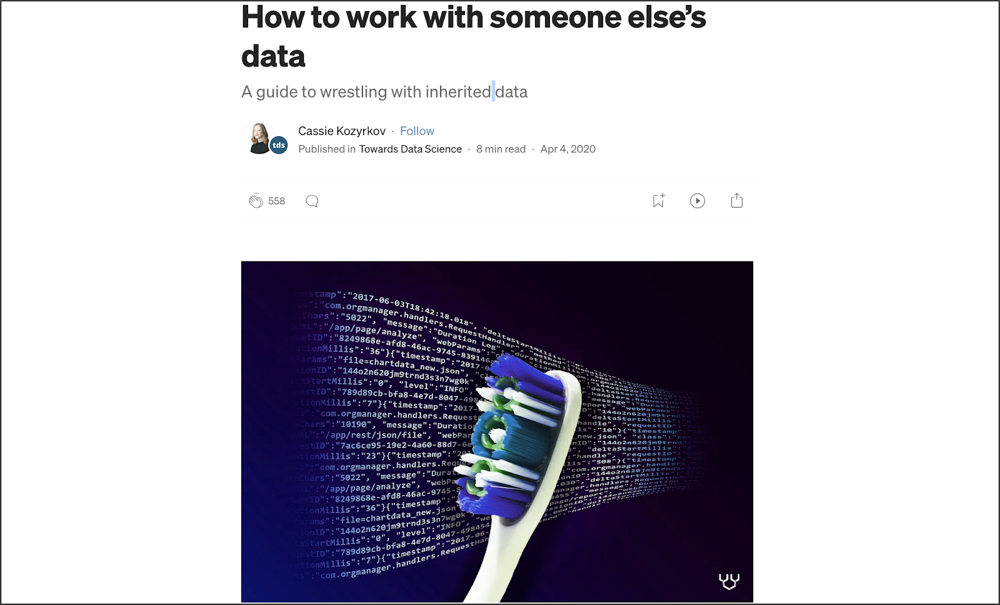

This post isn’t about coding or complex computer science or mathematics at all! It’s a practical guide for avoiding pitfalls when working with third-party data. Such topics are highly relevant, and writing about them is another great way to access exciting career opportunities.

## **Other approaches**

This list isn’t exhaustive. It’s intended to give you an idea of the possibilities for presenting your work and becoming an active participant in the field. Some people share Jupyter notebooks, others write helpful articles, and others create podcasts or YouTube videos. For example, consider[ this YouTube video on bias in machine learning and AI, produced by Angelica Spratley](https://www.youtube.com/watch?v=J2gTrr0SKuI), a data scientist and educator.

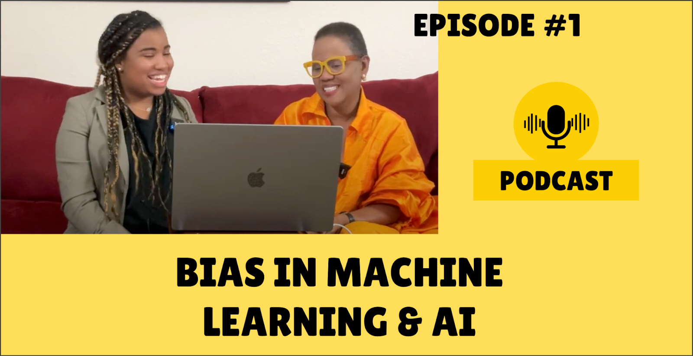

By the way, bias is something you’ll learn about in the course on machine learning. Find what excites you, and your enthusiasm will be evident. The possibilities are vast if you follow your imagination and motivation to contribute to the exciting world of data.

## **Key Takeaways**

These are just a few ways you can share your work. One of the great things about doing so is that it gives you a public-facing profile that employers can review. If someone searches for your name and finds an impressive portfolio, it gives you more opportunity to stand out. Additionally, presenting your work forces you to clearly explain (and thus understand) your methodologies, making you a stronger data practitioner. Whichever way you choose to share your work, be creative, have fun, and don’t be afraid to put yourself out there. This is your opportunity to impress!
