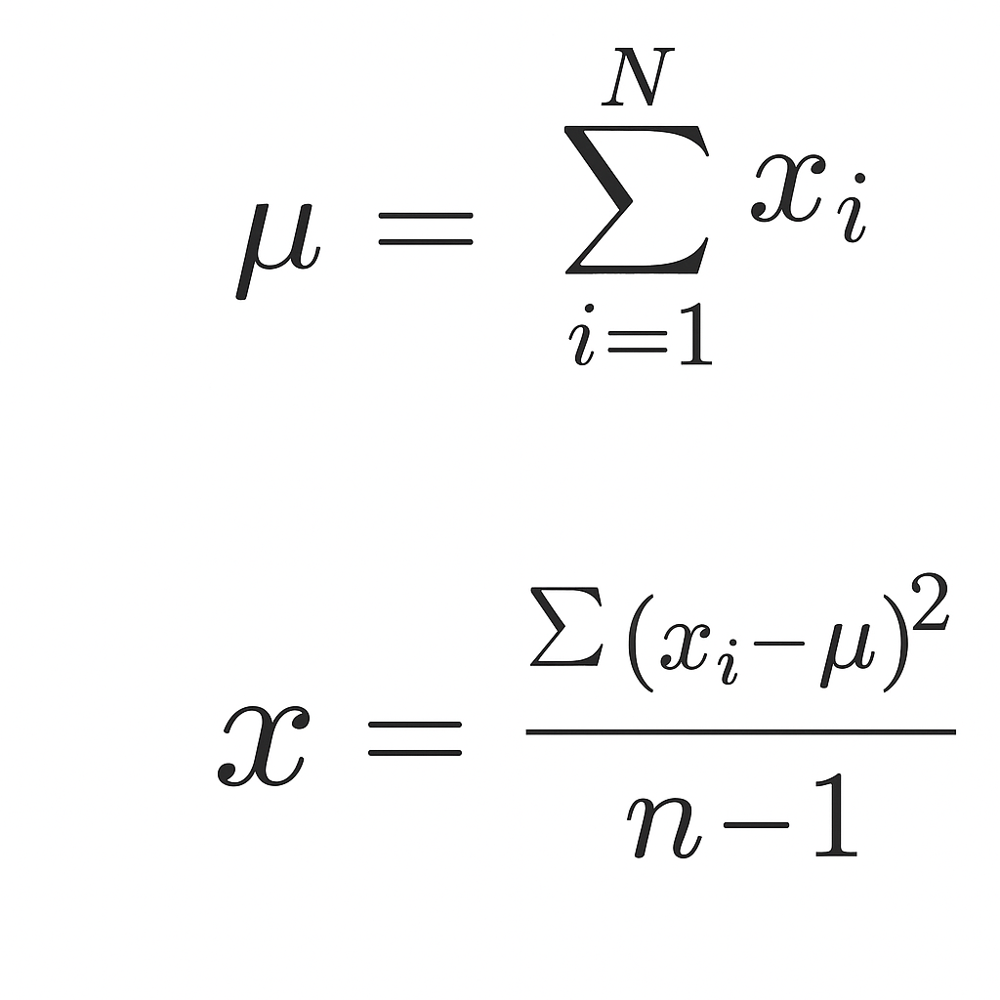
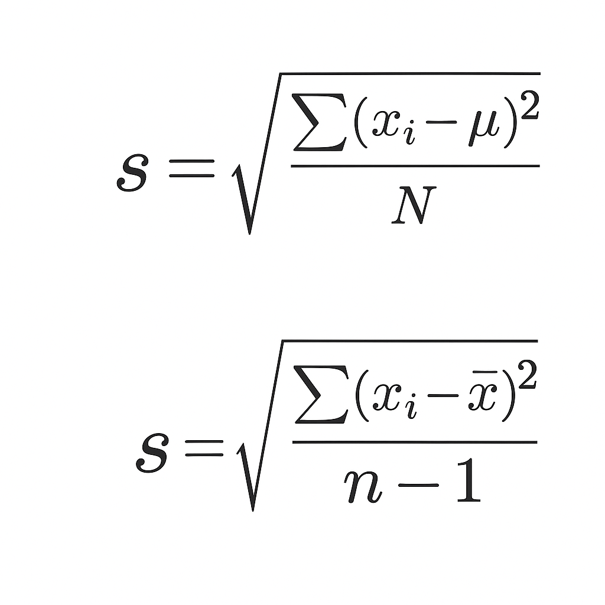
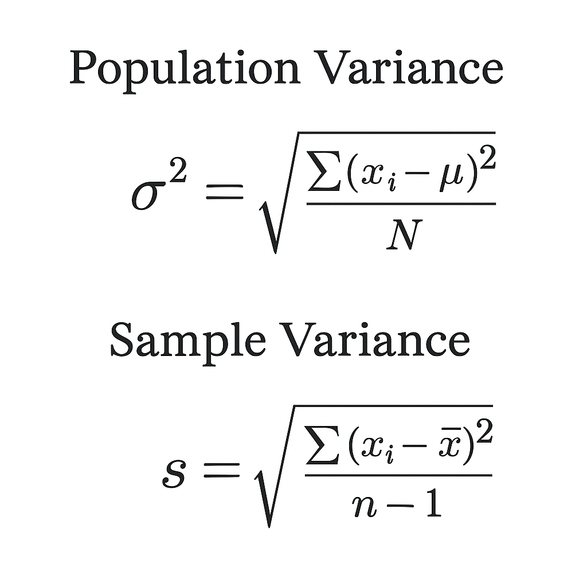
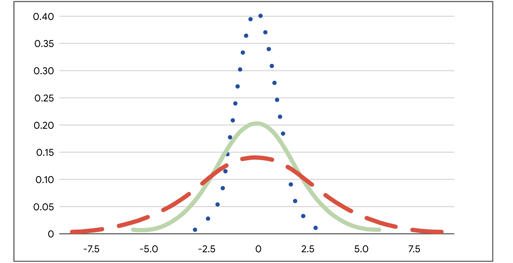
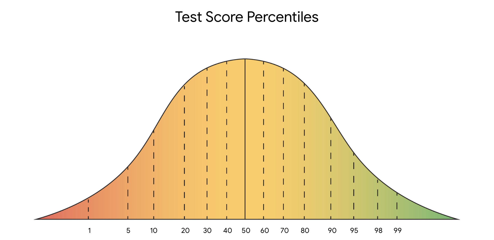
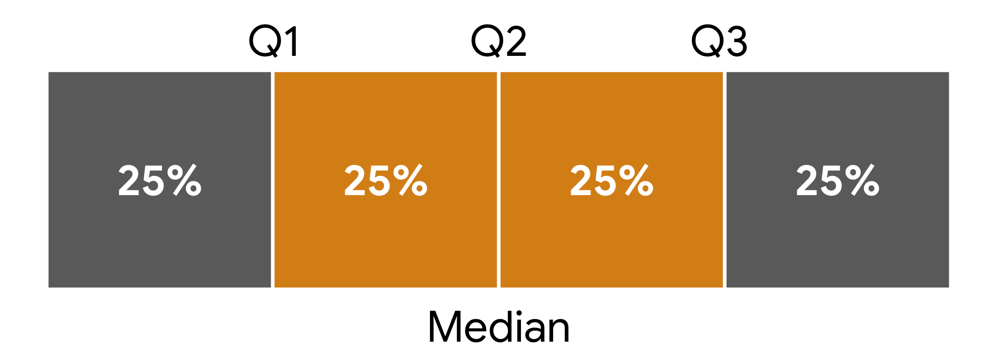
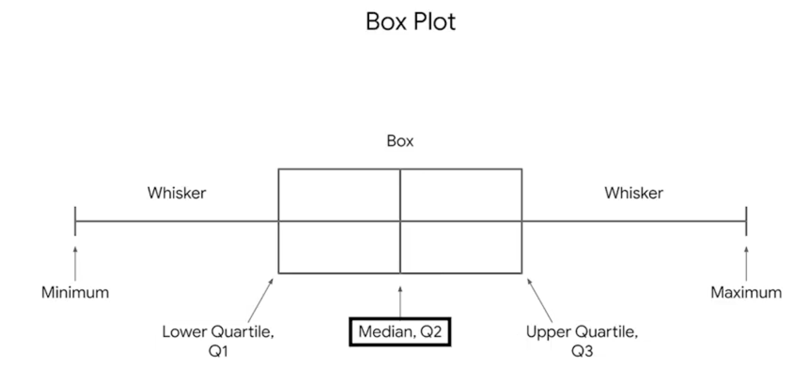

# Introduction to Statistics

In this section of the course, you’ll learn about the foundational role of statistics in data science. This section focuses on fundamental concepts of descriptive statistics, such as measures of central tendency, dispersion, and position.

Statistics is the study of collection, analysis, and interpretation of data. We'll learn:

1. A/B Testing
2. Descriptive Statistics
   - Measures of Central Tendency (center): Mean, Median, & Mode
   - Measures of Dispersion (spread): Range, Standard Devidation
   - Measures of Position
3. Inferential Statistics
4. Types of Descriptive Statistics

Data professionals use statistical methods to:

- Identify meaningful patterns and relationships in data
- Analyze and quantify uncertainty
- Generate insights from data
- Make informed predictions about the future
- Solve complex problems

---

# 1. A/B Testing

A way to compare two versions of something to find out which version performs better.

Companies use A/B testing to evaluate everything from website design, to mobile apps, to online ads, to marketing emails. A/B testing has become popular because it works well for many online applications.

**Example 1:**
Businesses often use A/B testing to create two versions of a webpage to find out which one gets more clicks, purchases, or subscriptions. Even small changes to a webpage, like changing the color, size, or location of a button, can increase financial gains. A/B tests help business leaders optimize product performance and improve customer experience.

**Example 2:**
You might send two versions of a marketing email to your customer list to find out which version results in more sales, or you might test two versions of an online ad to discover which one visitors click on more often. Once you've conducted the A/B test, you can use the data to make permanent changes to your ad.

## A/B Test Steps

1. Analyze a small group of users called a **sample**
2. Decide the **sample size**
3. Determine the **statistical significance**

***Definitions***

- ***Sample***: A subset of the larger population
- ***Sampling***: The process of selecting a subset of data from a population
- ***Inferential statistics***: Make inferences about a dataset based on a sample
- ***Confidence interval***: A range of values that describes the uncertainty surrounding an estimate
- ***Statistical significance***: The claim that the results of a test or experiment are not explainable by chance alone

---

# 2. Descriptive Statistics

**Descriptive Statistics** describe or summarize the main features of a dataset. Following are the forms of Descriptive Statistics

- **Visuals**: Graphs and tables
- **Summary Statistics**:
  - **Measures of Central Tendency**: Describe the center of your dataset (e.g., Mean)
  - **Measures of Dispersion**: Describe the spread or variation in your dataset (e.g., Standard Deviation)

## Measures of Central Tendency

**Mean**: The average value in the dataset

---

**Median**: The middle value in the datasetFound by arranging all the values and picking the middle. If there’s an even number, take the average of the two middle values.

### Mean vs. Median

- Both describe the central location
- Mean is sensitive to outliers
- Median is better when outliers are present

**Mode**: The most frequently occurring value in the dataset

- A dataset can have no mode, one mode, or multiple modes
- Especially useful for **categorical data**

**Range**: The range is the difference between the largest and smallest value in a dataset.

- The range is a useful metric because it's easy to calculate and gives you a very quick understanding of the overall spread of your dataset.

**Standard deviation**: Standard deviation measures how spread out your values are from the mean of your dataset.

- Standard deviation gives you a more nuanced idea of the variation in your data.
- It calculates the typical distance of a data point from the mean.
- The larger the standard deviation, the more spread out your values are from the mean.

**Variance**: Variance is the average of the squared difference of each data point from the mean. Basically, it's the square of the standard deviation.

plots of three normal probability distributions to get a better idea of spread.

---

### Visualization

Let’s examine the plots of three normal probability distributions to get a better idea of spread. For now, just know that the mean is the highest point on each curve, right in the center.

Each curve has the same mean and a different standard deviation. The standard deviation of the blue dotted curve is 1, the green solid curve is 2, and the red dashed curve is 3. The blue dotted curve has the least spread since most of its data values fall close to the mean. Therefore, the blue dotted curve has the smallest standard deviation. The red dashed curve has the most spread since most of its data values fall farther away from the mean. Therefore, the red dashed curve has the largest standard deviation.

## Measures of Position

**Measures of position** determine the position of a value in relation to other values in a dataset.

**Percentiles**: The value below which a percentage of data fall. Percentiles divide your data into 100 equal parts. Percentiles give the relative position or rank of a particular value in a dataset.

Note: Percentiles and percentages are distinct concepts. For example, say you score 90/100, or 90%, on a test. This doesn’t necessarily mean your score of 90% is in the 90th percentile. Percentile depends on the relative performance of all test takers. If half of all test takers score above 90%, then a score of 90% will be in the 50th percentile.

**Quartiles**: Divides the values in a dataset into four equal parts. Three quartiles divide the data into four quarters. Quartiles let you compare values relative to the four quarters of data. Each quarter includes 25% of the values in your dataset.

**Interquartile range**: The middle 50% of your data is called the interquartile range, or IQR. The interquartile range is the distance between the first quartile (Q1) and the third quartile (Q3). This is the same as the distance between the 25th and 75th percentiles.

IQR is useful for determining the relative position of your data values. For instance, data values outside the interval Q1 - (1.5 * IQR) and Q3 + (1.5 * IQR) are often considered outliers.

*Note*: Technically, IQR is a measure of dispersion because it measures the spread of the middle half or middle 50% of your data (between Q1 and Q3). IQR is less sensitive to outliers than the range because it doesn’t include the more extreme values in your dataset.

**Five number summary**: Finally, you can summarize the major divisions in your dataset with the five number summary. The five numbers include:

- The minimum
- The first quartile (Q1)
- The median, or second quartile (Q2)
- The third quartile (Q3)
- The maximum

The five number summary is useful because it gives you an overall idea of the distribution of your data, from the extreme values to the center. You can visualize it with a box plot.

The box part of the box plot goes from Q1 to Q3. The vertical line in the middle of the box is the median (Q2). The horizontal lines on each side of the box, known as whiskers, go from Q1 to the minimum, and from Q3 to the maximum.

# 3. Inferential Statistics

Make inferences about a dataset based on a sample of the data.

- **Sample**: A subset of a population
- **Population**: Every possible element you want to measure
- A good sample should be **representative** of the population

### Important Terms

- **Parameter**: A characteristic of a population
- **Statistic**: A characteristic of a sample

---

## Summary: What You’ll Learn

- Descriptive Statistics
- Inferential Statistics
- Probability
- Sampling & Sampling Distribution
- Confidence Interval
- Hypothesis Testing
